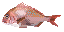
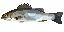

---
var:
  header-title: "Pythonで釣りゲームを作ろう ゲームづくり編1　魚を釣るシステムを作ろう"
  header-date: "2024年10月24日（木）"
---

# ゲームづくり編1　魚を釣るシステムを作ろう


## はじめに

ここからは実際に**ゲームを製作していきましょう！**

<br>

## もくじ
- [環境を整える](advance01.html#環境を整える)
- [ゲーム画面を表示する](advance01.html#ゲーム画面を表示する)
- [スペースキーが押されたか調べる](advance01.html#スペースキーが押されたか調べる)
- [釣りをする](advance01.html#釣りをする)
- [魚の重さや売値を決める](advance01.html#魚の重さや売値を決める)
- [大物を判定する](advance01.html#大物を判定する)


<br>

## 環境を整える

- 新しいフォルダの作成

ファイル→ファイルを開くを選択


<br>

`FishingGame`という名前で新しいフォルダを作成して開く


<br>


<br>

- 画像フォルダの作成

エクスプローラを右クリックして、`img`フォルダを作成


<br>

- ファイルの作成

エクスプローラを右クリックして、`game01.py`ファイルを作成


<br>
<br>

## ゲーム画面を表示する

まずはtkinterを用いて、ゲーム画面を表示します。背景として、以下の画像を使用します。[こちらから画像をダウンロードしてください。](https://github.com/k-768/python_game/blob/master/img/fishing_map.png)


ファイルをダウンロードしたら、画像を先ほど作成した`img`フォルダの**中に移動してください**。


### ウィンドウを表示する

以下のプログラムを実行してください。


```python{.numberLines caption="game01.py"}
import os
import tkinter as tk


#>>ディレクトリ>>
cwd = os.getcwd() 


#>>マップ設定>>
MAP_SIZE_X = 384  #マップ画像のxピクセル数
MAP_SIZE_Y = 384  #マップ画像のyピクセル数

MAGNIFICATION_RATE = 2 # 拡大率


#>>ウィンドウ、キャンバス>>
CANVAS_WIDTH = MAP_SIZE_X * MAGNIFICATION_RATE #キャンバス幅
CANVAS_HEIGHT = MAP_SIZE_Y * MAGNIFICATION_RATE #キャンバス高さ
MARGINE_X = 2 #マージン
MARGINE_Y = 2 #マージン
CANVAS_SIZE = f"{CANVAS_WIDTH+MARGINE_X}x{CANVAS_HEIGHT+MARGINE_Y}"#キャンバスサイズ


#ウィンドウ設置
root = tk.Tk()
root.title("game01")
root.geometry(CANVAS_SIZE)


#キャンバス設置
canvas = tk.Canvas(root,width = CANVAS_WIDTH,height = CANVAS_HEIGHT,bg = "skyblue")
canvas.pack()


#マップ画像
MAP_IMAGE = tk.PhotoImage(file = cwd+"/img/fishing_map.png") # 画像を読み込む
MAP_BIG_IMAGE = MAP_IMAGE.zoom(MAGNIFICATION_RATE,MAGNIFICATION_RATE) # 画像を拡大する

canvas.create_image(0,0,image = MAP_BIG_IMAGE ,tag="bgimage",anchor=tk.NW) # 画像を配置する


# メインループ
root.mainloop()
```

実行すると、背景画像が表示されます。


---

画像を表示する流れを見ていきましょう。`35行目`からに注目してください。

```python{.numberLines startFrom="35" caption="game01.py(抜粋)"}
#マップ画像
MAP_IMAGE = tk.PhotoImage(file = cwd+"/img/fishing_map.png") # 画像を読み込む
MAP_BIG_IMAGE = MAP_IMAGE.zoom(MAGNIFICATION_RATE,MAGNIFICATION_RATE) # 画像を拡大する

canvas.create_image(0,0,image = MAP_BIG_IMAGE ,tag="bgimage",anchor=tk.NW) # 画像を配置する

```

<br>

まず、`36行目`で画像を読み込んで`MAP_IMAGE`という変数に格納(データを保存)しています。画像を読み込むには`tk.PhotoImage`命令を用います。

```python{caption="画像の読み込み"}
MAP_IMAGE = tk.PhotoImage(file = ファイルのパス)

```

画像を読み込むには、画像の**パス**が必要になります。**パスとは、PC内の住所のようなもの**です。エクスプローラでは、画面の上部に表示されています。


<div class="note type-tips">

**パスの求め方**

今回のプログラムでは、Pythonのosモジュールを使って、作業ディレクトリ(作業フォルダー)のパスを取得しています。

新しいファイル`cwd.py`を作成して、以下のプログラムを実行してみてください。

```python{.numberLines caption="cwd.py"}
import os

# 現在の作業ディレクトリを取得
cwd = os.getcwd()  # cwdは "current working directory" の略
print(cwd)  # 現在の作業ディレクトリのパスが表示されます
```

実行すると、今開いているフォルダ`FishingGame`までのパスが表示されます。このように、自動でパスを取得して変数`cwd`に格納しています。

フォルダ`FishingGame`までのパスは取得できたので、あとはフォルダ`FishingGame`から画像までのパスをつなげれば画像のパスがわかります。

```python{.numberLines startFrom="36" caption="画像の読み込み"}
MAP_IMAGE = tk.PhotoImage(file = cwd+"/img/fishing_map.png") # 画像を読み込む
```

少し難しい話ですが「そういうもんなんだ」と思ってさらっといきましょう。

</div>

<br>

次に、`zoom`命令を用いて取得した画像を拡大しています。拡大率は整数である必要があります。今回は2倍です。

```python{caption="画像の拡大"}
画像を格納した変数.zoom(X方向の拡大率,Y方向の拡大率)
```

<br>

最後に、拡大した画像を配置します。`create_image`命令を用います。使い方は以下の通りです。

```python{caption="画像の配置"}
canvas.create_image(x座標,y座標,image = 画像を格納した変数 ,tag=画像の識別用の名前,anchor=基準点)
```

- **tag**は、画像を後で消したりする際に必要になります。識別用なので、ほかの画像とかぶっていない必要があります。

- **anchor**は、**指定したx座標、y座標を画像のどこに合わせるか**というものです。`tk.NW`はN=北、W=西という意味で北西、つまり**画像の左上を基準にしてください**という意味になります。

<br>
<br>


### キーボード入力を判定する

[基礎編10](basic10.html#キーボードの入力を判定する)で学んだキーボード入力の判定を組み合わせましょう。ただし、今後アニメーションをするにあたって少し工夫しなければいけません。以下のプログラムをコピペして実行してください。


```python{.numberLines caption="game01.py"}
import copy
import os
import tkinter as tk


#>>ディレクトリ>>
cwd = os.getcwd() 


#>>マップ設定>>
MAP_SIZE_X = 384  #マップ画像のxピクセル数
MAP_SIZE_Y = 384  #マップ画像のyピクセル数

MAGNIFICATION_RATE = 2 # 拡大率


#>>ウィンドウ、キャンバス>>
CANVAS_WIDTH = MAP_SIZE_X * MAGNIFICATION_RATE #キャンバス幅
CANVAS_HEIGHT = MAP_SIZE_Y * MAGNIFICATION_RATE #キャンバス高さ
MARGINE_X = 2 #マージン
MARGINE_Y = 2 #マージン
CANVAS_SIZE = f"{CANVAS_WIDTH+MARGINE_X}x{CANVAS_HEIGHT+MARGINE_Y}"#キャンバスサイズ


#ウィンドウ設置
root = tk.Tk()
root.title("game01")
root.geometry(CANVAS_SIZE)


#キャンバス設置
canvas = tk.Canvas(root,width = CANVAS_WIDTH,height = CANVAS_HEIGHT,bg = "skyblue")
canvas.pack()


#マップ画像
MAP_IMAGE = tk.PhotoImage(file = cwd+"/img/fishing_map.png") # 画像を読み込む
MAP_BIG_IMAGE = MAP_IMAGE.zoom(MAGNIFICATION_RATE,MAGNIFICATION_RATE) # 画像を拡大する

canvas.create_image(0,0,image = MAP_BIG_IMAGE ,tag="bgimage",anchor=tk.NW) # 画像を配置する


#ゲームの基本となる1ティック時間(ms)
TICK_TIME = 50  


#>>ゲームのメインループ関数>>
def gameLoop():
    global key,currentKey,prevKey
    
    prevKey = copy.deepcopy(key)
    key = copy.deepcopy(currentKey)
    root.after(TICK_TIME,gameLoop)


#>>キー監視>>
currentKey = []#現在押されているキー
key = []       #前回の処理から押されたキー
prevKey = [] #前回の処理までに押されたキー

#何かのキーが押されたときに呼び出される関数
def press(e):
    keysym = e.keysym
    if keysym not in currentKey:#始めて押されたならば
        currentKey.append(keysym)
        print(f"pressed:{keysym}")
    if keysym not in key:#前回の処理から始めて押されたならば
        key.append(keysym)

#何かのキーが離されたときに呼び出される関数
def release(e):
    keysym = e.keysym
    currentKey.remove(keysym)
    print(f"released:{keysym}")

#キー入力をトリガーに関数を呼び出すよう設定する
root.bind("<KeyPress>", press)
root.bind("<KeyRelease>", release)


#>>メインループ>>>
gameLoop()
print("start!")
root.mainloop()
```

このプログラムでは、**押しているキーがリスト**`key`**に格納されています**。そのため、配列の中身をチェックすることでキーボード入力を判定します。

このプログラムをもとにして、改造を進めましょう。

<br>
<br>

## スペースキーが押されたか調べる

`50行目`の`gameloop`内に、スペースキーが押されたか判定するプログラムを作成しましょう。

リストの中に目当てのものが含まれているかを調べるには、`in`を用います。

```python{caption="リストの中身を調べる"}
# もしリストの中にキーワードがあれば
if キーワード in リスト:
```

<br>

これを使って、以下のように判定できます。

```python{.numberLines startFrom=47 caption="game01.py（抜粋）"}
#>>ゲームのメインループ関数>>
def gameLoop():
    global key,currentKey,prevKey
    
    if "space" in key:
        print("スペースキーが押された！")
    
    prevKey = copy.deepcopy(key)
    key = copy.deepcopy(currentKey)
    root.after(TICK_TIME,gameLoop)
```

実行してスペースキーを押してみてください。スペースキーを**一度押しただけで数回コメントが出力される**ことがあると思います。

---

これを防ぐには、以下のように、少し前のキーボードの状態も考慮する必要があります。

リスト`prevKey`には、**前回のループのときに押されたキー**（少し前に押されていたキー）が格納されています。

```python{caption="押された瞬間だけ判定する方法"}
# もしスペースキーが押されたなら
if "space" in key and "space" not in prevKey:
```

まず、**①**`"space" in key`の部分で**現在の入力（今押されているか）の確認**を行います。

そして、**②**`"space" not in prevKey`の部分で**前回の入力(前は押されていなかったか)を確認**します。

**③**両方の条件を満たすとき、プレイヤーは**今回新たにスペースキーを押した**、ということになります。

<br><br>

<div class="note type-tips">

**判定の使い分け**

ゲームにおけるキーボード入力には、**連続入力（＝長押し）を受け付ける場合と受け付けない場合があります**。ここでは、キャラクターの移動とメニュー操作を例に説明します。

<br>


#### 1: キャラクターの移動


- **例:** ゲーム中に、キャラクターを前に移動させたいとき、プレイヤーは「W」キーを押し続けます。
- **求める動作:** 「W」キーを押し続けると、キャラクターがどんどん前に移動します。つまり、長押しを受け付けたいということです。


**処理の流れ**

1. プレイヤーが「W」キーを押したとき、キャラクターは移動を始めます。
2. プレイヤーが「W」キーを押し続けている限り、キャラクターはそのまま移動し続けます。
3. プレイヤーが「W」キーを離したら、キャラクターの移動を止めます。

<br>


#### 2: メニュー操作

- **例:** メニュー画面で「Space」キーを使って決定をしたいとき、プレイヤーが「Space」キーを押し続けると、メニューが毎回選択されてしまいます。
- **求める動作:** 「Space」キーは一度だけ押されたときだけ決定をするようにしたい。つまり、長押しは受け付けないということです。


**処理の流れ**

1. プレイヤーが「Space」キーを押したとき、決定の処理を行います。
2. しかし、次に「Space」キーが押されるまでは、再度決定処理が行われないようにします。これにより、連続してメニューが選択されることを防ぎます。


#### まとめ

- キャラクター移動の場合:

連続入力を**許可します**。キーボードを長押しすると、キャラクターが**移動し続ける**ようにします。

- メニュー操作の場合:

連続入力を**許可しません**。キーボードを長押ししても、**一度しか処理を行いません**。

---

このように、場面によってキーボード入力の扱いが異なることを理解し、連続入力が必要なケースとそうでないケースを明確に分けて考えることが大切です！

</div>

<br>
<br>

## 釣りをする

[基礎編6](basic06.html)で作った`randomfish.py`を組み合わせて、スペースキーを押したときに釣りができるようにしましょう。

まず、`random`モジュールをインポートしてください。

```python{}
import random
```

<br>

次に、魚のデータを関数`gameLoop`の**前に追加**してください。

```python{.numberLines startFrom=47 caption="game01.py（抜粋）"}
#>>魚のデータ>>
LOW_RARE_FISH = ["アジ","サバ","イワシ"]
MIDDLE_RARE_FISH = ["カワハギ","タチウオ","メバル"]
HIGH_RARE_FISH = ["タイ","スズキ","サケ"]

FISH_LIST = []
FISH_LIST.append(LOW_RARE_FISH)
FISH_LIST.append(MIDDLE_RARE_FISH)
FISH_LIST.append(HIGH_RARE_FISH)

FISH_WEIGHT = [75,20,5] #排出率
```

<br>

スペースキーが押されたときに、ランダムで魚を選択するようにしましょう。


```python{.numberLines startFrom=60 caption="game01.py（抜粋）"}
#>>ゲームのメインループ関数>>
def gameLoop():
    global key,currentKey,prevKey
    
    if "space" in key and "space" not in prevKey:
        selectedFish = random.choice(random.choices(FISH_LIST,k=1,weights=FISH_WEIGHT)[0])
        print(selectedFish)
```


**<i class="fa-solid fa-terminal"></i> 実行結果**

```
pressed:space
アジ
released:space
pressed:space
イワシ
released:space
```

これで、**スペースキーを押すとランダムな魚が釣れる**プログラムが完成しました！
ここからは**魚の重さや売値**の概念を追加したり、**リザルト画面**を表示させたり、**キャラクターにアニメーション**をさせたりと、ゲームのクオリティを上げる作業に入っていきましょう。


## 魚の重さや売値を決める

「同じ種類の魚でも、大物が釣れたりすると面白いかも？」と、いうことで、魚のデータを辞書型に変更して、平均の重さやkg単価といったデータを持たせました。

魚のデータを**更新**してください。

```python{.numberLines startFrom=47 caption="game01.py（抜粋）"}
#>>魚のデータ>>
LOW_RARE_FISH = [
        {
        "name":"イワシ",
        "aveWeight":0.12, #平均重量
        "price":60 #kg単価
        },
        {
        "name":"アジ",
        "aveWeight":0.17,
        "price":100
        },
        {
        "name":"サバ",
        "aveWeight":0.35,
        "price":50
        },
    ]
MIDDLE_RARE_FISH = [
        {
        "name":"タチウオ",
        "aveWeight":3,
        "price":12
        },
        {
        "name":"カワハギ",
        "aveWeight":0.4,
        "price":80
        },
        {
        "name":"メバル",
        "aveWeight":0.43,
        "price":100
        },
    ]
HIGH_RARE_FISH = [
        {
        "name":"タイ",
        "aveWeight":5.4,
        "price":20
        },
        {
        "name":"スズキ",
        "aveWeight":5.5,
        "price":19
        },
        {
        "name":"サケ",
        "aveWeight":1.65,
        "price":65
        },
    ]

FISH_LIST = []
FISH_LIST.append(LOW_RARE_FISH)
FISH_LIST.append(MIDDLE_RARE_FISH)
FISH_LIST.append(HIGH_RARE_FISH)

FISH_WEIGHT = [75,20,5] #排出率
```

データを更新してプログラムを実行してみると、ランダムな辞書型が出力されます。
`print(selectedFish["name"])`で**名前**を、`print(selectedFish["aveWeight"])`
で平均の重さを取得できます。魚の重さをランダムに決めて、重さに基づいて魚の売値を決定するようにしてみましょう。


```python{.numberLines startFrom=107 caption="game01.py（抜粋）"}
#>>ゲームのメインループ関数>>
def gameLoop():
    global key,currentKey,prevKey
    
    if "space" in key and "space" not in prevKey:
        selectedFish = random.choice(random.choices(FISH_LIST,k=1,weights=FISH_WEIGHT)[0])
        #魚の重さを決定(ランダム 平均の0.5~1.5倍)
        fishWeight = selectedFish["aveWeight"]*random.uniform(0.5, 1.5)
        fishWeight = round(fishWeight,2) #少数第3位で四捨五入
        #重さから売却価格を決定
        fishPrice = fishWeight * selectedFish["price"]
        print(selectedFish["name"])
        print(fishWeight)
        print(fishPrice)
```

## 大物を判定する

魚の重さだけ表示されても、釣った魚が大きいのか小さいのかピンときません。そこで、重さでランクをつけてみましょう。

- 平均の**1.4倍**以上の重さ : **ゴールドランク**　価格はさらに1.4倍
- 平均の**1.2倍**以上の重さ : **シルバーランク**　価格はさらに1.2倍
- それ以下 : **ブロンズランク**

以下のプログラムの条件を埋めて、プログラムを完成させてみましょう。

```python{.numberLines startFrom=107 caption="game01.py（抜粋）"}
#>>ゲームのメインループ関数>>
def gameLoop():
    global key,currentKey,prevKey

    if "space" in key and "space" not in prevKey:
        selectedFish = random.choice((random.choices(FISH_LIST,k=1,weights = FISH_WEIGHT))[0])
        #魚の重さを決定(ランダム 平均の0.5~1.5倍)
        fishWeight = selectedFish["aveWeight"]*random.uniform(0.5, 1.5)
        fishWeight = round(fishWeight,2) #少数第3位で四捨五入
        #重さから売却価格を決定
        fishPrice = fishWeight * selectedFish["price"]
        
        #魚のランクを決定、ランクに応じて価格を上方修正
        if ここに条件を記入:
            fishRank = "gold"
            fishPrice *= 1.4
        elif ここに条件を記入:
            fishRank = "silver"
            fishPrice *= 1.2
        else:
            fishRank = "bronze"
        
        fishPrice = round(fishPrice) #四捨五入

        print(fishRank+"ランクの"+selectedFish["name"])
        print(fishWeight)
        print(fishPrice)
```

できたら答え合わせをしてください。

<br><br><br><br>

```python{.numberLines startFrom=107 caption="答え"}
        #魚のランクを決定、ランクに応じて価格を上方修正
        if fishWeight > selectedFish["aveWeight"]*1.4:
            fishRank = "gold"
            fishPrice *= 1.4
        elif fishWeight > selectedFish["aveWeight"]*1.2:
            fishRank = "silver"
            fishPrice *= 1.2
        else:
            fishRank = "bronze"
```


ゴールドランクなら「**超大物**のサバ」、シルバーランクなら「**大物**のサバ」と、魚の名前の前に表示させます。ついでに、`print`文で出力している名前や重さを、以下の文章にします。

- ○○kgの△△を釣り上げた!
- XXGで売れそうだ!

穴埋めを完成させてください。


```python{.numberLines startFrom=141 caption="game01.py（抜粋）"}
    if rank == "silver":
        name = "大物の"+selectedFish["name"]
    elif rank == "gold":
        name = "超大物の"+selectedFish["name"]
    else:
        name = selectedFish["name"]
    
    print(ここに記入)
    print(ここに記入)
```


<br><br><br><br>

```python{.numberLines startFrom=107 caption="答え"}
    print(str(fishWeight)+"kgの"+name+"を釣り上げた!")
    print(str(fishPrice)+"Gで売れそうだ!")
```

ここまでのプログラム全体は[ここから](https://github.com/k-768/PythonGameProgramming/blob/main/programs/game01.py
)確認できます。

---

## 結果表示ウィンドウをつくる

せっかく釣れたのに文字だけではつまらないので、画像を使って結果ウィンドウをつくりましょう。

まずは魚の画像を用意しましょう。




[ここから](https://github.com/k-768/python_game/blob/master/img/fish.zip)zipファイルをダウンロードしてください。

ファイルをダウンロードしたら、解凍したのち、中の画像すべてを`img`フォルダの**中に移動してください**。

<br>

次に、新しいpythonファイル`game02.py`を作成してください。[ここから](https://github.com/k-768/PythonGameProgramming/blob/main/programs/game02.py
)プログラムをコピー＆ペーストして実行してみてください。**スペースキーを押すと結果ウィンドウが表示されます**。このプログラムの要点について解説します。

<br>

```python{.numberLines startFrom=46 caption="game02.py（抜粋）"}
FISH_IMAGE = {
    "イワシ":tk.PhotoImage(file = cwd+"/img/iwashi.png"),
    "アジ":tk.PhotoImage(file = cwd+"/img/aji.png"),
    "サバ":tk.PhotoImage(file = cwd+"/img/saba.png"),
    "タチウオ":tk.PhotoImage(file = cwd+"/img/tachiuo.png"),
    "カワハギ":tk.PhotoImage(file = cwd+"/img/kawahagi.png"),
    "メバル":tk.PhotoImage(file = cwd+"/img/mebaru.png"),
    "タイ":tk.PhotoImage(file = cwd+"/img/iwashi.png"),
    "スズキ":tk.PhotoImage(file = cwd+"/img/iwashi.png"),
    "サケ":tk.PhotoImage(file = cwd+"/img/sake.png"),
}
BIG_FISH_IMAGE = {key :img.zoom(2,2) for key , img in FISH_IMAGE.items()}
```

`46行目`では、先ほど用意した魚の画像を読み込んでいます。`57行目`では、**リストの内包表記**というものを用いて、全ての画像を2倍に拡大しています。

<br>

`59行目`からの魚のデータに画像の項目を追加し、先ほど読み込んだ画像を読み込んでいます。

```python{.numberLines startFrom=46 caption="game02.py（抜粋）"}
LOW_RARE_FISH = [
        {
        "name":"イワシ",
        "img":FISH_IMAGE["イワシ"],
        "aveWeight":0.12, #平均重量
        "price":60 #kg単価
        },
        {
        "name":"アジ",
        "img":FISH_IMAGE["アジ"],
        "aveWeight":0.17,
        "price":100
        },
        {
        "name":"サバ",
        "img":FISH_IMAGE["サバ"],
        "aveWeight":0.35,
        "price":50
        },
    ]
```

`128行目`から、結果ウィンドウを表示する関数が記述されています。ウィンドウの中に画像や文字を配置し、表示します。

```python{.numberLines startFrom=128 caption="game02.py（抜粋・コメント付き）"}
# >>釣り結果表示>>
RESULT_X = 300 #結果ウィンドウの幅
RESULT_Y = 200 #結果ウィンドウの高さ
RESULT_SIZE = f"{RESULT_X}x{RESULT_Y}+{int((CANVAS_WIDTH - RESULT_X)/2)}+{int((CANVAS_HEIGHT - RESULT_Y)/2)}" #結果ウィンドウのサイズと位置を指定

# 結果ウィンドウを表示する関数
def showResultWindow(fish,rank,weight,price):
    global resultWindow,FISH_IMAGE
    #ウィンドウ設置
    resultWindow = tk.Toplevel() #結果ウィンドウをトップレベル（最前面）にする
    resultWindow.title("Result") #ウィンドウのタイトルを設定
    resultWindow.geometry(RESULT_SIZE) #ウィンドウの大きさを設定
    resultWindow.resizable(False,False) #ウィンドウの大きさを変更不可にする
    resultWindow.configure(bg="burlywood") #ウィンドウの背景色を設定
    
    
    # フレームの作成と設置　（フレーム：グループ化し、整理するためのコンテナ）
    nameFrame = tk.Frame(resultWindow , relief=tk.RAISED , bg="burlywood") #フレームの設定
    canvasFrame = tk.Frame(resultWindow , relief=tk.RAISED , bg="burlywood")
    infoFrame = tk.Frame(resultWindow , relief=tk.RAISED , bg="burlywood")
    nameFrame.pack(fill = tk.BOTH, pady=10) #フレームの配置
    canvasFrame.pack(fill = tk.BOTH, pady=0)
    infoFrame.pack(fill = tk.BOTH, pady=10)
    
    if rank == "silver": #ランクに応じて名前や色を変更する
        name = "大物の"+fish #名前の前に追加
        color = "LightBlue4" #魚の名前の文字色を指定
    elif rank == "gold":
        name = "超大物の"+fish
        color = "gold"
    else:
        name = fish
        color = "DarkOrange4"
    
    viewCanvas = tk.Canvas(canvasFrame,width = 96,height = 48,bg = "burlywood",highlightthickness=0) #魚の画像を表示するキャンバス
    viewCanvas.pack() #キャンバス設置
    viewCanvas.create_image(48,24,image =BIG_FISH_IMAGE[fish],tag="view",anchor=tk.CENTER) #魚の画像を配置
    
    # ラベル（文字列を表示する部品）の作成
    fishName = tk.Label(nameFrame, text=name, font=("MSゴシック", "20", "bold"),fg = color,bg = "burlywood")# 名前
    fishWeight = tk.Label(infoFrame, text=str(weight)+" kg", font=("MSゴシック", "16"),bg = "burlywood")# 重さ
    fishPrice = tk.Label(infoFrame, text=str(price)+" G", font=("MSゴシック", "16"),bg = "burlywood") # 売値
    fishName.pack()
    fishWeight.pack()
    fishPrice.pack()
```

<br>

今回初めて出てきたラベルは、以下の命令で作成、配置できます。

```python{caption="ラベルの作成"}
ラベルの変数名 = tk.label(ウィンドウ,text="表示する文字",font=("フォント名",フォントサイズ))
```

```python{caption="ラベルの配置"}
ラベルの変数名.place(x=x座標,y=y座標)
```

<br>

次回は、いよいよキャラクターの描画などを実装していきます。