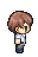

---
var:
  header-title: "Pythonで釣りゲームを作ろう ゲームづくり編2　状態遷移図を用いて処理を考えよう"
  header-date: "2024年11月26日（火）"
---

# ゲームづくり編2　状態遷移図を用いて処理を考えよう

## シーン管理

ゲームづくりにおいて、重要な考えが**シーン**と呼ばれるものです。普段私たちが遊んでいるゲームにはさまざまなシーンが存在します。例えば、「戦闘画面」「移動画面」「購入画面」などです。これらのシーンをスムーズに切り替えるためには、どの画面からどの画面へどうやって移るのかをしっかりと計画する必要があります。

あるいは、ターン制のバトルゲームを考えてみましょう。自分のターンのときは、「攻撃する」「道具を使う」など、コマンドを選択できる必要がありますが、相手のターンのときは選択できないようにする必要があります。

このように、ゲームづくりにおいて「**この入力はいつ受け付けるのか**」や「**この画像はいつ表示するのか**」といった**条件の計画・確認が非常に重要**になります。そこで**状態遷移図**というツールが役立ちます。

今回は、状態遷移図について学んだうえで、釣りゲームにどのような処理が必要か考え、実装していきましょう。


<br>

## もくじ
- [](advance01.html#)


<br>

## 状態遷移図とは

状態遷移図とは、**ゲームの各シーン（状態）がどのように繋がっているかを図で表したもの**です。例えば、プレイヤーが移動中の画面から敵に遭遇したら戦闘画面に切り替わる、戦闘が終わったら再び移動画面に戻る、などの流れを**視覚的**に示します。これにより、**ゲーム全体の流れが一目でわかる**ようになります。

<br>


状態遷移図は、**状態を表す〇**と、**イベントを表す矢印**で構成されます。イベントでは、**条件や処理内容**を記述します。

<br>

例として、キャラクターを操作してマップ上を移動するプログラムを考えてみましょう。


この場合、「待機中」と「移動中」の**2つの状態**があります。**それぞれの状態を矢印がつないで**います。

今、「待機中」の状態にあるとしましょう。「待機中」から「移動中」に向かう矢印には「移動キー押下 かつ 移動可能」とあります。これは、その状態に**遷移する条件**を示しています。つまり、**「待機中」のときに移動キーを押して、なおかつその先が移動できる場所であれば「移動中」になる**ということです。

今度は、「待機中」から自分自身に向かっている矢印に注目してください。この場合、**スラッシュの前半は条件を、後半は処理を示しています**。つまり、**「待機中」のときに移動キーを押したものの、その先が移動できない場所であれば、向きだけ変えて状態は「待機中」のまま**ということです。

このように、状態遷移図を用いることで**全体の流れを整理できる**点が大きな魅力です。どの状態からどの状態へ、どんな条件で移るのかが明確になるため、設計がスムーズになります。また、状態遷移図を作成することで、必要な画面の切り替えを忘れてしまったり、逆に不要な切り替えをしてしまうなどの**ミスも防ぐことができます**。特に**複雑なシステムではとても大きな効果を発揮**します。

この状態遷移図を活用して釣りゲームを作っていきましょう！...と言いたいところですが、先に少し準備が必要です。

<br>

## 画像を準備する

キャラクタの画像を用意しましょう。




[ここから](https://github.com/k-768/python_game/blob/master/img/character_sideview.zip)zipファイルをダウンロードしてください。

ファイルをダウンロードしたら、解凍したのち、中の画像すべてを`img`フォルダの**中に移動してください**。


完成版

```python{.numberLines startFrom=1 caption="game02.py"}
import copy
import os
import random
import tkinter as tk


#>>ディレクトリ>>
cwd = os.getcwd()


#>>マップ設定>>
MAP_SIZE_X = 384  #マップ画像のxピクセル数
MAP_SIZE_Y = 384  #マップ画像のyピクセル数

MAGNIFICATION_RATE = 2 # 拡大率


#>>ウィンドウ、キャンバス>>
CANVAS_WIDTH = MAP_SIZE_X * MAGNIFICATION_RATE #キャンバス幅
CANVAS_HEIGHT = MAP_SIZE_Y * MAGNIFICATION_RATE #キャンバス高さ
MARGINE_X = 2 #マージン
MARGINE_Y = 2 #マージン
CANVAS_SIZE = f"{CANVAS_WIDTH+MARGINE_X}x{CANVAS_HEIGHT+MARGINE_Y}"#キャンバスサイズ

#ウィンドウ設置
root = tk.Tk()
root.title("game02")
root.geometry(CANVAS_SIZE)

#キャンバス設置
canvas = tk.Canvas(root,width = CANVAS_WIDTH,height = CANVAS_HEIGHT,bg = "skyblue")
canvas.pack()


#マップ画像
MAP_IMAGE = tk.PhotoImage(file = cwd+"/img/fishing_map.png")
MAP_BIG_IMAGE = MAP_IMAGE.zoom(MAGNIFICATION_RATE,MAGNIFICATION_RATE)

#>>キャラクター>>
CHARA_WIDTH = 64  #キャラの幅
CHARA_HEIGHT = 96 #キャラの高さ

#キャラクターの座標
charaX = 160 * MAGNIFICATION_RATE 
charaY = 128 * MAGNIFICATION_RATE
flag = "defalt"
'''
defalt:通常状態
wait:釣り中
bite:ウキがピクつく
hit:ウキが沈む
fight:格闘中
success:釣り成功
miss:釣り失敗
result:釣り結果表示
'''
fishingCount = 0
waitTick = 0


#ゲームの基本となる1ティック時間(ms)
TICK_TIME = 50  

#キャラクターの画像
CHARA_IMAGE = {
    "defalt":tk.PhotoImage(file = cwd+"/img/character_A.png"),
    "wait":tk.PhotoImage(file = cwd+"/img/character_B.png"),
    "bite":tk.PhotoImage(file = cwd+"/img/character_C.png"),
    "hit":tk.PhotoImage(file = cwd+"/img/character_D1.png"),
    "fight":tk.PhotoImage(file = cwd+"/img/character_D2.png"),
}

BIG_CHARA_IMAGE = {key :img.zoom(MAGNIFICATION_RATE,MAGNIFICATION_RATE) for key , img in CHARA_IMAGE.items()}


#キャラクターを再描写する関数  
def setChara(x,y,state):
    """
    x:キャラのX座標
    y:キャラのY座標
    state:キャラの状態
    """
    #今の画像を消して再描写
    canvas.delete("chara")
    canvas.create_image(x,y,image =BIG_CHARA_IMAGE[state] ,tag="chara",anchor=tk.NW)


#>>アイコン>>
# 吹き出し

ICON = {
    "fishing":tk.PhotoImage(file = cwd+"/img/fishing.png"),
    "hit":tk.PhotoImage(file = cwd+"/img/hit.png"),
    "miss":tk.PhotoImage(file = cwd+"/img/miss.png"),
    "fight":tk.PhotoImage(file = cwd+"/img/fight.png"),
    "success":tk.PhotoImage(file = cwd+"/img/success.png"),
}

BIG_ICON = {key :img.zoom(MAGNIFICATION_RATE//1,MAGNIFICATION_RATE//1) for key , img in ICON.items()}


#アイコンを表示する関数
def setIcon(x,y,type):
    """
    x:キャラのx座標
    y:キャラのy座標
    type:アイコンの種類
    """
    # 一回消して再描写
    canvas.delete("icon")
    canvas.create_image(
        x+CHARA_WIDTH*MAGNIFICATION_RATE/16,
        y-CHARA_HEIGHT*MAGNIFICATION_RATE/2,
        image = BIG_ICON[type],
        tag="icon",
        anchor=tk.NW
        )


#>>魚>>
fishFlag = False #釣り可能かどうか


FISH_IMAGE = {
    "イワシ":tk.PhotoImage(file = cwd+"/img/iwashi.png"),
    "アジ":tk.PhotoImage(file = cwd+"/img/aji.png"),
    "サバ":tk.PhotoImage(file = cwd+"/img/saba.png"),
    "タチウオ":tk.PhotoImage(file = cwd+"/img/tachiuo.png"),
    "カワハギ":tk.PhotoImage(file = cwd+"/img/kawahagi.png"),
    "メバル":tk.PhotoImage(file = cwd+"/img/mebaru.png"),
    "タイ":tk.PhotoImage(file = cwd+"/img/tai.png"),
    "スズキ":tk.PhotoImage(file = cwd+"/img/suzuki.png"),
    "サケ":tk.PhotoImage(file = cwd+"/img/sake.png"),
}
BIG_FISH_IMAGE = {key :img.zoom(2,2) for key , img in FISH_IMAGE.items()}

LOW_RARE_FISH = [
        {
        "name":"イワシ",
        "img":FISH_IMAGE["イワシ"],
        "aveWeight":0.12, #平均重量
        "price":60 #kg単価
        },
        {
        "name":"アジ",
        "img":FISH_IMAGE["アジ"],
        "aveWeight":0.17,
        "price":100
        },
        {
        "name":"サバ",
        "img":FISH_IMAGE["サバ"],
        "aveWeight":0.35,
        "price":50
        },
    ]
MIDDLE_RARE_FISH = [
        {
        "name":"タチウオ",
        "img":FISH_IMAGE["タチウオ"],
        "aveWeight":3,
        "price":12
        },
        {
        "name":"カワハギ",
        "img":FISH_IMAGE["カワハギ"],
        "aveWeight":0.4,
        "price":80
        },
        {
        "name":"メバル",
        "img":FISH_IMAGE["メバル"],
        "aveWeight":0.43,
        "price":100
        },
    ]
HIGH_RARE_FISH = [
        {
        "name":"タイ",
        "img":FISH_IMAGE["タイ"],
        "aveWeight":5.4,
        "price":20
        },
        {
        "name":"スズキ",
        "img":FISH_IMAGE["スズキ"],
        "aveWeight":5.5,
        "price":19
        },
        {
        "name":"サケ",
        "img":FISH_IMAGE["サケ"],
        "aveWeight":1.65,
        "price":65
        },
    ]
FISH_LIST = []
FISH_LIST.append(LOW_RARE_FISH)
FISH_LIST.append(MIDDLE_RARE_FISH)
FISH_LIST.append(HIGH_RARE_FISH)


# >>釣り結果表示>>
RESULT_X = 300
RESULT_Y = 200
RESULT_SIZE = f"{RESULT_X}x{RESULT_Y}+{int((CANVAS_WIDTH - RESULT_X)/2)}+{int((CANVAS_HEIGHT - RESULT_Y)/2)}"


def showResultWindow(fish,rank,weight,price):
    global resultWindow,FISH_IMAGE
    #ウィンドウ設置
    resultWindow = tk.Toplevel()
    resultWindow.title("Result")
    resultWindow.geometry(RESULT_SIZE)
    resultWindow.resizable(False,False)
    resultWindow.configure(bg="burlywood")
    
    
    # フレームの作成と設置
    nameFrame = tk.Frame(resultWindow , relief=tk.RAISED , bg="burlywood")
    canvasFrame = tk.Frame(resultWindow , relief=tk.RAISED , bg="burlywood")
    infoFrame = tk.Frame(resultWindow , relief=tk.RAISED , bg="burlywood")
    nameFrame.pack(fill = tk.BOTH, pady=10)
    canvasFrame.pack(fill = tk.BOTH, pady=0)
    infoFrame.pack(fill = tk.BOTH, pady=10)
    
    if(rank == "silver"):
        name = "大物の"+fish
        color = "LightBlue4"
    elif(rank == "gold"):
        name = "超大物の"+fish
        color = "gold"
    else:
        name = fish
        color = "DarkOrange4"
    
    viewCanvas = tk.Canvas(canvasFrame,width = 192,height = 48,bg = "burlywood",highlightthickness=0)
    viewCanvas.pack()
    viewCanvas.create_image(96,24,image =BIG_FISH_IMAGE[fish],tag="view",anchor=tk.CENTER)
    
    # 各種ウィジェットの作成
    fishName = tk.Label(nameFrame, text=name, font=("MSゴシック", "20", "bold"),fg = color,bg = "burlywood")
    fishWeight = tk.Label(infoFrame, text=str(weight)+" kg", font=("MSゴシック", "16"),bg = "burlywood")
    fishPrice = tk.Label(infoFrame, text=str(price)+" G", font=("MSゴシック", "16"),bg = "burlywood")
    fishName.pack()
    fishWeight.pack()
    fishPrice.pack()


#>>ゲームのメインループ関数>>
def gameLoop():
    global charaX,charaY,flag,key,currentKey,prevKey,waitTick,fishingCount,resultWindow

    if (flag == "defalt"): #待機中のとき 
        setChara(charaX,charaY,"defalt")
        if(("space" in key) and ("space" not in prevKey)):
            canvas.delete("icon")#釣りアイコン削除
            flag = "wait"
            waitTick = random.randint(round(3000/TICK_TIME),round(5000/TICK_TIME))#3-5秒
            fishingCount = 0
    
    if (flag == "wait"):#魚釣り中のとき
        if(fishingCount == 0):#初回なら
            #キャラクター再描写
            setChara(charaX,charaY,"wait")
        elif(fishingCount >= waitTick):#待ち時間を終えたとき
            if(random.randint(1,3)!=1):#2/3の確率で
                flag = "hit"
                waitTick = 10
                fishingCount = 0
            else:
                flag = "bite"
                waitTick = random.randint(2,10)
                fishingCount = 0
        
        # スペースキーが再び押された時
        if(("space" in key) and ("space" not in prevKey) and  fishingCount): 
            setIcon(charaX,charaY,"miss")#アイコン描写
            print("早すぎた！")
            flag = "defalt"
            
        if (flag == "wait"):
            fishingCount += 1
    
    elif (flag == "bite"): #魚が少し喰いついたとき
        if(("space" in key) and ("space" not in prevKey)):  #スペースキー押下されたとき
            setIcon(charaX,charaY,"miss")#アイコン描写
            print("早すぎた！")
            flag = "defalt"
        elif(fishingCount == 0):#初回なら
            setChara(charaX,charaY,"bite")
            print("ピク...")
        elif(fishingCount == waitTick):#待ち時間を終えたとき
            flag = "wait"
            waitTick = random.randint(round(200/TICK_TIME),round(2000/TICK_TIME))
            fishingCount = 0
        
        if (flag == "bite"):
            fishingCount += 1
    
    elif (flag == "hit"): #魚がかかったとき
        if(("space" in key) and ("space" not in prevKey)):  #スペースキー押下されたとき
            flag = "fight"
            setIcon(charaX,charaY,"fight")#アイコン描写
            fishingCount = 0
        elif(fishingCount == 0):#初回なら
            #キャラクター再描写
            setChara(charaX,charaY,"fight")
            setIcon(charaX,charaY,"hit")#アイコン描写
            print("ビク！")
        elif(fishingCount == waitTick):#待ち時間を終えたとき
            print("遅すぎた！")
            setIcon(charaX,charaY,"miss")#アイコン描写
            flag = "defalt"
        
        if (flag == "hit"):
            fishingCount += 1
    
    elif (flag == "fight"): #かかった魚を釣り上げているとき
        if(fishingCount < 20):
            if(fishingCount%4 == 0 or fishingCount%4 == 1 ):
                setChara(charaX,charaY,"hit")
            else:
                setChara(charaX,charaY,"fight")
            fishingCount += 1
        else:
            flag = "success"
    
    elif(flag == "success"): #釣りに成功したとき
        #ランダムな魚を選択
        selectedFish = random.choice((random.choices(FISH_LIST,k=1,weights = (75,20,5)))[0])
        print(selectedFish["name"])
        #魚の重さを決定(ランダム 0.5~1.5)
        fishWeight = selectedFish["aveWeight"]*random.uniform(0.5, 1.5)
        fishWeight = round(fishWeight,2) #少数第3位で四捨五入
        print(fishWeight)
        #重さから売却価格を決定
        fishPrice = fishWeight * selectedFish["price"]
        
        #魚のランクを決定、ランクに応じて価格を上方修正
        if(fishWeight > selectedFish["aveWeight"]*1.4):
            fishRank = "gold"
            fishPrice *= 1.4
        elif (fishWeight > selectedFish["aveWeight"]*1.2):
            fishRank = "silver"
            fishPrice *= 1.2
        else:
            fishRank = "bronze"
        
        fishPrice = round(fishPrice) #四捨五入
        
        
        #釣りの姿勢から通常状態に戻す
        setChara(charaX,charaY,"defalt")
        canvas.delete("rod")
        #*魚を仮表示
        setIcon(charaX,charaY,"success")#アイコン描写
        showResultWindow(selectedFish["name"],fishRank,fishWeight,fishPrice)
        flag = "result"
        
    elif(flag == "result"): #結果表示中のとき
        if(("space" in key) and ("space" not in prevKey)):  #スペースキー押下されたとき
            flag = "defalt"
            canvas.delete("fish")
            setIcon(charaX,charaY,"fishing")
            resultWindow.destroy()
    
    prevKey = copy.deepcopy(key)
    key = copy.deepcopy(currentKey)
    root.after(TICK_TIME,gameLoop)

#>>キー監視>>
currentKey = []#現在押されているキー
key = []       #前回の処理から押されたキー
prevKey = [] #前回の処理までに押されたキー

#何かのキーが押されたときに呼び出される関数
def press(e):
    keysym = e.keysym
    if(keysym not in currentKey):#始めて押されたならば
        currentKey.append(keysym)
        print(f"pressed:{keysym}")
    if(keysym not in key):#前回の処理から始めて押されたならば
        key.append(keysym)

#何かのキーが離されたときに呼び出される関数
def release(e):
    keysym = e.keysym
    currentKey.remove(keysym)
    print(f"released:{keysym}")

#キー入力をトリガーに関数を呼び出すよう設定する
root.bind("<KeyPress>", press)
root.bind("<KeyRelease>", release)

#>>メインループ>>>
canvas.create_image(0,0,image = MAP_BIG_IMAGE ,tag="bgimage",anchor=tk.NW)
setChara(charaX,charaY,"defalt")
setIcon(charaX,charaY,"fishing")

gameLoop()
print("start!")
root.mainloop()
```