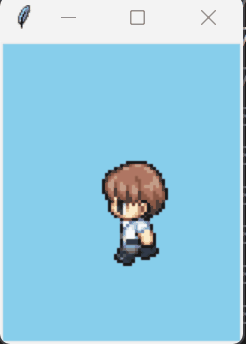

---
var:
  header-title: "Pythonで釣りゲームを作ろう ゲームづくり編3　マップを表示してキャラクターを動かそう"
  header-date: "2024年12月6日（金）"
---

# ゲームづくり編3　マップを表示してキャラクターを動かそう

## ゲームのマップ

マップ画面は、RPG（ロールプレイングゲーム）やシミュレーションゲームなど、多くのゲームで欠かせない要素です。今回は、**マップチップ**と呼ばれるものを使って、マップを描写してみましょう。後半では、作成したマップの上を、キャラクターで移動できるようにしましょう。**キャラチップ**と呼ばれる画像を用いてキャラクタの歩行を行います。

<br>

## もくじ
- [マップチップとは](advance03.html#マップチップとは)
- [Tkinterでウィンドウを表示する](advance03.html#Tkinterでウィンドウを表示する)
- [マップチップを表示する](advance03.html#マップチップを表示する)
- [1枚の画像からマップチップを取得する](advance03.html#1枚の画像からマップチップを取得する)
- [データをもとにマップチップを配置する](advance03.html#データをもとにマップチップを配置する)
- [さらに豪華なマップを作ろう](advance03.html#さらに豪華なマップを作ろう)

---

- [キャラチップとは](advance03.html#キャラチップとは)
- [キャラクターを表示させて移動する](advance03.html#キャラクターを表示させて移動する)
- [水の中には入れないようにする](advance03.html#水の中には入れないようにする)
- [キャラクターをアニメーションさせる](advance03.html#キャラクターをアニメーションさせる)
- [組み合わせる](advance03.html#組み合わせる)

<br>

## マップチップとは

ゲームには、プレイヤーが探索するフィールド、都市、ダンジョンなど、さまざまな場所が登場します。しかし、一枚一枚のマップを手作業で描いていくとなると、膨大な時間と労力が必要になります。そこで登場するのが**マップチップ**です。マップチップとは、草地や水辺、道路など、**地形やオブジェクト(チェストやタンスなどの「もの」)を表す小さな画像パーツ**のことです。これらを組み合わせることで、効率的にマップを構築することができます。

画像の用意や処理がシンプルなため、容量制限の厳しかった昔はほとんどのゲームでマップチップが採用されていました。マップチップを用いれば、初心者でも簡単に取り組めます。

<br>

今回は、`grass.png` `sand.png` `water.png`の3枚の画像を用います。ダウンロードして`img`フォルダに入れておいてください。


これらの画像は、基本的に同じサイズでそろえることをおすすめします。今回は`64x64px`で統一しています。

<br>

## Tkinterでウィンドウを表示する

新しいファイル`map01.py`を作成して、ウィンドウを表示するプログラムを制作していきましょう。

```python{.numberLines startFrom=1 caption="map01.py"}
import os
import tkinter as tk

#>>ディレクトリ>>
cwd = os.getcwd()

#>>マップ設定>>
CHIP_SIZE = 64 #マップチップの大きさ
X_MAPSIZE = 20 #マップのx方向タイル数
Y_MAPSIZE = 10 #マップのy方向タイル数

#>>ウィンドウ、キャンバス>>
CANVAS_WIDTH = CHIP_SIZE * X_MAPSIZE #キャンバス幅
CANVAS_HEIGHT = CHIP_SIZE * Y_MAPSIZE #キャンバス高さ
MARGINE_X = 2 #マージン
MARGINE_Y = 2 #マージン
CANVAS_SIZE = f"{CANVAS_WIDTH+MARGINE_X}x{CANVAS_HEIGHT+MARGINE_Y}"#キャンバスサイズ

#ウィンドウ設置
root = tk.Tk()
root.title("マップ表示")
root.geometry(CANVAS_SIZE)

#キャンバス設置
canvas = tk.Canvas(root,width = CANVAS_WIDTH,height = CANVAS_HEIGHT,bg = "skyblue")
canvas.pack()


#>>マップチップ>>
MAP_CHIP = [
    tk.PhotoImage(file = cwd+"/img/grass.png"),
    tk.PhotoImage(file = cwd+"/img/sand.png"),
    tk.PhotoImage(file = cwd+"/img/water.png")
    ]

root.mainloop()
```

最初の方で多くの数字を設定しています。マップチップの大きさや、マップのサイズなどです。このように、様々な値を変数で置いておくことで、あとからの修正が楽になります。

そして、用意した画像は最後の方で**リスト**に格納されています。

---

- **ChallengeA3-1**　草の画像を呼び出したいとき、どのように記述したら良いですか。

**<i class="fa-solid fa-check"></i>解答**

<span class="masked">`MAP_CHIP[0]`</span>

<br>

## マップチップを表示する

以下の一文を`root.mainloop()`の前に追加してみてください。

```python{.numberLines startFrom=36 caption="map01.py（続き）"}
canvas.create_image(0,0,image =MAP_CHIP[0] ,tag="chip1",anchor=tk.NW)
```

実行すると、マップチップが表示されます。


<br>

これを並べていけばマップが作れます。一つ右に砂地を配置してみましょう。

```python{.numberLines startFrom=37 caption="map01.py（続き）"}
canvas.create_image(CHIP_SIZE,0,image =MAP_CHIP[1] ,tag="chip2",anchor=tk.NW)
```

これを繰り返し行えばよいので、繰り返し文を用いてみましょう。**先ほどの画像を配置する2文を消して、以下のプログラムを追加してください。**

```python{.numberLines startFrom=36 caption="map01.py（続き）"}
for y in range(Y_MAPSIZE):
    for x in range(X_MAPSIZE):
        canvas.create_image(x*CHIP_SIZE,y*CHIP_SIZE,image =MAP_CHIP[0] ,tag=f"chip{x},{y}",anchor=tk.NW)
```

ウィンドウが草地で埋め尽くされたら成功です。


<br>

## 1枚の画像からマップチップを取得する

今回はマップチップは3種類しかありませんが、これが50種類、100種類と増えてくると画像の管理が大変になります。そこで、通常は**マップチップを並べた画像1枚**を分割して利用します。

 以下の画像をダウンロードして`sheet1.png`という名前で`img`フォルダに入れておいてください。


1枚の画像を分割するためには、**Pillow**と呼ばれるライブラリが必要になります。ターミナルで、以下を入力して実行してください。

```
pip install Pillow
```


```python{.numberLines startFrom=1 caption="map02.py"}
import os
import tkinter as tk
from PIL import Image,ImageTk

#>>ディレクトリ>>
cwd = os.getcwd()

#>>マップ設定>>
CHIP_SIZE = 64 #マップチップの大きさ
X_MAPSIZE = 20 #マップのx方向タイル数
Y_MAPSIZE = 10 #マップのy方向タイル数

#>>ウィンドウ、キャンバス>>
CANVAS_WIDTH = CHIP_SIZE * X_MAPSIZE #キャンバス幅
CANVAS_HEIGHT = CHIP_SIZE * Y_MAPSIZE #キャンバス高さ
MARGINE_X = 2 #マージン
MARGINE_Y = 2 #マージン
CANVAS_SIZE = f"{CANVAS_WIDTH+MARGINE_X}x{CANVAS_HEIGHT+MARGINE_Y}"#キャンバスサイズ

#ウィンドウ設置
root = tk.Tk()
root.title("マップ表示")
root.geometry(CANVAS_SIZE)

#キャンバス設置
canvas = tk.Canvas(root,width = CANVAS_WIDTH,height = CANVAS_HEIGHT,bg = "skyblue")
canvas.pack()


#>>マップチップ>>
#マップチップを1枚の画像に並べたマップシートを読み込む
MAP_SHEET = Image.open(cwd+"/img/sheet1.png")

#読み込んだ画像から縦横何枚ずつチップがあるか求める
CHIP_X = MAP_SHEET.width // CHIP_SIZE
CHIP_Y = MAP_SHEET.height // CHIP_SIZE

#マップシートをマップチップに分割し配列に格納する
MAP_CHIP = []

for y in range(CHIP_Y):
    for x in range(CHIP_X):
        image = ImageTk.PhotoImage(MAP_SHEET.crop((
            CHIP_SIZE*x , 
            CHIP_SIZE*y , 
            CHIP_SIZE*(x+1) , 
            CHIP_SIZE*(y+1)
            )))
        MAP_CHIP.append(image)

for y in range(Y_MAPSIZE):
    for x in range(X_MAPSIZE):
        canvas.create_image(x*CHIP_SIZE,y*CHIP_SIZE,image =MAP_CHIP[1] ,tag=f"chip{x},{y}",anchor=tk.NW)

root.mainloop()
```

まず、`35行目` `36行目`で、読み込んだ画像に縦横何枚ずつチップが並べられているか計算しています。

`MAP_SHEET.width`が読み込んだ画像の幅です。これをマップチップ1枚の幅`CHIP_SIZE`で割ることで、横に並んでいるマップチップの枚数`CHIP_X`を求めます。

```python{.numberLines startFrom=35 caption="map02.py（抜粋）"}
CHIP_X = MAP_SHEET.width // CHIP_SIZE
```

`41行目`からは2重ループを用いてマップチップを1枚1枚切り取り、リストに格納しています。

これで、マップを表示する仕組みは完成しました。

<br>

## データをもとにマップチップを配置する

マップを表示するためのデータは、二次元リストで簡単につくれます。

```python{caption="マップのデータ"}
MAP_DATA = [
    [1, 1, 1, 1, 1, 1, 1, 1, 1, 1, 1, 1, 1, 1, 1, 3, 3, 3, 3, 3],
    [1, 1, 1, 1, 1, 1, 1, 1, 1, 1, 1, 1, 1, 1, 1, 1, 3, 3, 3, 3],
    [1, 1, 1, 1, 1, 1, 1, 1, 1, 1, 1, 1, 1, 1, 2, 2, 3, 3, 3, 3],
    [1, 1, 1, 1, 1, 1, 1, 1, 1, 2, 2, 2, 2, 2, 3, 3, 3, 3, 3, 3],
    [1, 1, 1, 1, 1, 1, 2, 2, 2, 3, 3, 3, 3, 3, 3, 3, 3, 3, 3, 3],
    [1, 1, 1, 1, 2, 2, 3, 3, 3, 3, 3, 3, 3, 3, 3, 3, 3, 3, 3, 3],
    [2, 2, 1, 2, 3, 3, 3, 3, 3, 3, 3, 3, 3, 3, 3, 3, 3, 3, 3, 3],
    [3, 3, 2, 3, 3, 3, 3, 3, 3, 3, 3, 3, 3, 3, 3, 3, 3, 3, 3, 3],
    [3, 3, 3, 3, 3, 3, 3, 3, 3, 3, 3, 3, 3, 3, 3, 3, 3, 3, 3, 3],
    [3, 3, 3, 3, 3, 3, 3, 3, 3, 3, 3, 3, 3, 3, 3, 3, 3, 3, 3, 3],
]
```

リスト上のそれぞれの数字がマップチップの番号に対応しています。**1と書いてある場所には草地が**、**2と書いてある場所には砂地が**配置されます。


---

- **ChallengeA3-2**　以下のプログラムの`69行目`を改造して、データをもとにマップが表示されるようにしましょう。

ヒント：以下のプログラムでは、`img = MAP_CHIP[1]`となっているので全て草地が配置されます。この`1`をマップのデータに変えれば、配置される画像も場所によって変わるようになります。

答えを確認する前に、**MAP_DATAのいちばん左上を1→3に変えて実行してみてください。**表示されたマップの左上が水に代わっていればOKです。

```python{.numberLines startFrom=1 caption="map03.py"}
import os
import tkinter as tk
from PIL import Image,ImageTk

#>>ディレクトリ>>
cwd = os.getcwd()

#>>マップ設定>>
CHIP_SIZE = 64 #マップチップの大きさ
X_MAPSIZE = 20 #マップのx方向タイル数
Y_MAPSIZE = 10 #マップのy方向タイル数

#>>ウィンドウ、キャンバス>>
CANVAS_WIDTH = CHIP_SIZE * X_MAPSIZE #キャンバス幅
CANVAS_HEIGHT = CHIP_SIZE * Y_MAPSIZE #キャンバス高さ
MARGINE_X = 2 #マージン
MARGINE_Y = 2 #マージン
CANVAS_SIZE = f"{CANVAS_WIDTH+MARGINE_X}x{CANVAS_HEIGHT+MARGINE_Y}"#キャンバスサイズ

#ウィンドウ設置
root = tk.Tk()
root.title("マップ表示")
root.geometry(CANVAS_SIZE)

#キャンバス設置
canvas = tk.Canvas(root,width = CANVAS_WIDTH,height = CANVAS_HEIGHT,bg = "skyblue")
canvas.pack()


#>>マップチップ>>
#マップチップを1枚の画像に並べたマップシートを読み込む
MAP_SHEET = Image.open(cwd+"/img/sheet1.png")

#読み込んだ画像から縦横何枚ずつチップがあるか求める
CHIP_X = MAP_SHEET.width // CHIP_SIZE
CHIP_Y = MAP_SHEET.height // CHIP_SIZE

#マップシートをマップチップに分割し配列に格納する
MAP_CHIP = []

for y in range(CHIP_Y):
    for x in range(CHIP_X):
        image = ImageTk.PhotoImage(MAP_SHEET.crop((
            CHIP_SIZE*x , 
            CHIP_SIZE*y , 
            CHIP_SIZE*(x+1) , 
            CHIP_SIZE*(y+1)
            )))
        MAP_CHIP.append(image)


#>>マップデータ>>
MAP_DATA = [
    [1, 1, 1, 1, 1, 1, 1, 1, 1, 1, 1, 1, 1, 1, 1, 3, 3, 3, 3, 3],
    [1, 1, 1, 1, 1, 1, 1, 1, 1, 1, 1, 1, 1, 1, 1, 1, 3, 3, 3, 3],
    [1, 1, 1, 1, 1, 1, 1, 1, 1, 1, 1, 1, 1, 1, 2, 2, 3, 3, 3, 3],
    [1, 1, 1, 1, 1, 1, 1, 1, 1, 2, 2, 2, 2, 2, 3, 3, 3, 3, 3, 3],
    [1, 1, 1, 1, 1, 1, 2, 2, 2, 3, 3, 3, 3, 3, 3, 3, 3, 3, 3, 3],
    [1, 1, 1, 1, 2, 2, 3, 3, 3, 3, 3, 3, 3, 3, 3, 3, 3, 3, 3, 3],
    [2, 2, 1, 2, 3, 3, 3, 3, 3, 3, 3, 3, 3, 3, 3, 3, 3, 3, 3, 3],
    [3, 3, 2, 3, 3, 3, 3, 3, 3, 3, 3, 3, 3, 3, 3, 3, 3, 3, 3, 3],
    [3, 3, 3, 3, 3, 3, 3, 3, 3, 3, 3, 3, 3, 3, 3, 3, 3, 3, 3, 3],
    [3, 3, 3, 3, 3, 3, 3, 3, 3, 3, 3, 3, 3, 3, 3, 3, 3, 3, 3, 3],
]


for y in range(Y_MAPSIZE):
    for x in range(X_MAPSIZE):
        canvas.create_image(x*CHIP_SIZE,y*CHIP_SIZE,image = MAP_CHIP[1] ,tag=f"chip{x},{y}",anchor=tk.NW)

root.mainloop()
```

**<i class="fa-solid fa-check"></i>解答**

<span class="masked">`image =MAP_CHIP[MAP_DATA[y][x]]`</span>

---

これでデータをもとにマップチップを配置することができました！データを変更して、自由にマップを作ってみてください。

<br>

## さらに豪華なマップを作ろう

「マップチップ　フリー」などで検索すると、マップチップのフリー素材を入手できます。それを活用すればさらに豪華なマップを作れます。
おすすめのサイトを紹介します。

- [マップチップ　16×16 -ぴぽや倉庫](https://pipoya.net/sozai/assets/map-chip_tileset16/#マップセット１)

使う際は入手した画像が何px四方なのかよく確認して、プログラムの`CHIP_SIZE`を変更してください。また、**ゲームを公開したり配布する際は、使用する素材の規約をよく確認してください。**ぜひ、楽しく自分でマップを作りこんでみてください！


<br>

---

<br>

## キャラチップとは

ここからはキャラクターを操作するプログラムを実装していきます。

**キャラチップ**とは、ゲーム制作においてキャラクターのアニメーションを表現するための、複数のキャラクター画像が並べられた画像です。キャラクターチップとも呼ばれることがあります。


ゲーム内では、プログラムでキャラチップの一部を切り出し、画面上に描画します。今回は、「どの方向を向いているか」に応じてキャラチップの行を、「移動の状態」に応じてキャラチップの列を選択して表示します。

上の画像をダウンロードして`character.png`という名前で`img`フォルダに入れておいてください。

<br>

## キャラクターを表示させて移動する

新しいpythonファイル`move01.py`を作成してください。[ここから](https://github.com/k-768/PythonGameProgramming/blob/main/programs/move01.py
)プログラムをコピー＆ペーストして実行してみてください。**WASDでキャラクターが移動します**。このプログラムの要点について解説します。


<br>


```python{.numberLines startFrom=76 caption="move01（抜粋）.py"}
#>>キャラクター>>
CHARA_WIDTH = 64  #キャラの幅
CHARA_HEIGHT = 96 #キャラの高さ

#キャラクターのマップ座標
charaX = 2 
charaY = 2 
charaD = 1  #キャラの向き
flag = "default"
'''
default:通常状態
move:移動中
'''
```

`charaX`と`charaY`は、キャラクターの座標を示す変数です。しかしこれは普通のxy座標ではなく、マップ座標、つまり左上から**何マス目**かを示しています。
`charaD`はキャラクタの方向を示す変数です。下向きが0、左向きが1、右向きが2、上向きが3と、キャラチップの並びと同じ順番になっています。


`flag`は、魚を釣るプログラムでも登場した、場面を管理するためのものです。今回は待機中は`default`、移動中は`move`です。**キーボードの入力は待機中のみ受け付け、移動中は受け付けません**。

<br>

```python{.numberLines startFrom=95 caption="move01（抜粋）.py"}
#移動方向
moveX = 0
moveY = 0
```
`moveX`、`moveY`は移動するマス目を示しています。たとえば、`moveX = -1`なら、**1マス左に移動する**ということになります。

<br>


```python{.numberLines startFrom=99 caption="move01（抜粋）.py"}
#キャラチップを1毎の画像に並べたキャラシートを読み込む
CHARA_SHEET = Image.open(cwd+"/img/character.png")

#読み込んだ画像から縦横何枚ずつチップがあるか求める
CHARA_X = CHARA_SHEET.width // CHARA_WIDTH
CHARA_Y = CHARA_SHEET.height // CHARA_HEIGHT


#キャラチップに分割し2次元配列に格納する
CHARA_CHIP = []
#キャラシートの列数だけ繰り返す
for j in range(CHARA_Y): 
    #新しい行を作成
    row = []
    
    #キャラシートの行数だけ繰り返す
    for i in range(CHARA_X): 
        # キャラクターのチップを切り出して画像を作成
        image = ImageTk.PhotoImage(CHARA_SHEET.crop((
            CHARA_WIDTH * i,               # 左上のX座標
            CHARA_HEIGHT * j,              # 左上のY座標
            CHARA_WIDTH * (i + 1),         # 右下のX座標
            CHARA_HEIGHT * (j + 1)         # 右下のY座標
        )))
        
        # 作成した画像を行に追加
        row.append(image)
    
    # 行をCHARA_CHIPに追加
    CHARA_CHIP.append(row)
```

`99行目`からはキャラチップの画像を、マップチップとほとんど同じ方法で取得しています。
ただし、マップチップはリストに格納していましたが、**キャラチップは2次元リストに格納しています**。


---

- **ChallengeA4-1**　`CHARA_CHIP[1][2]`はどこの部分を指しますか。


回答はコラムの後にあります。

<div class="note type-tips">

**リストの内包表記**

Pythonの便利な文法の一つに**内包表記**というものがあります。**「リストを簡単に作れる書き方」**です。

```python{.numberLines startFrom=1 caption="リストの内包表記"}
CHARA_CHIP = [
    [
        ImageTk.PhotoImage(CHARA_SHEET.crop((
            CHARA_WIDTH * i,
            CHARA_HEIGHT * j,
            CHARA_WIDTH * (i + 1),
            CHARA_HEIGHT * (j + 1)
            ))) for i in range(CHARA_X)
        ]for j in range(CHARA_Y)
    ]
```

```python{.numberLines startFrom=1 caption="リストの内包表記を使わない場合"}
CHARA_CHIP = []
#キャラシートの列数だけ繰り返す
for j in range(CHARA_Y): 
    #新しい行を作成
    row = []
    
    #キャラシートの行数だけ繰り返す
    for i in range(CHARA_X): 
        # キャラクターのチップを切り出して画像を作成
        image = ImageTk.PhotoImage(CHARA_SHEET.crop((
            CHARA_WIDTH * i,               # 左上のX座標
            CHARA_HEIGHT * j,              # 左上のY座標
            CHARA_WIDTH * (i + 1),         # 右下のX座標
            CHARA_HEIGHT * (j + 1)         # 右下のY座標
        )))
        
        # 作成した画像を行に追加
        row.append(image)
    
    # 行をCHARA_CHIPに追加
    CHARA_CHIP.append(row)
```

このように、同じ処理でも簡単に記述できます。リストの内包表記をざっくり説明すると、ループを使ってリストを作るコードを1行にまとめる方法です。しかし、少し理解が難しいので今回は扱いません。気になった方は自分で調べてみてください。

</div>

**<i class="fa-solid fa-check"></i>解答**


<br>

---

プログラムの解説に戻ります。

```python{.numberLines startFrom=150 caption="move01.py（抜粋）"}
#>>ゲームのメインループ関数>>
def gameLoop():
    global charaX,charaY,charaD,moveCount,moveX,moveY,flag,key,currentKey,prevKey
    
    if len(key)> 0:
        lastKey = key[len(key) - 1] #最後に押されたキー
    else:
        lastKey = ""
    
    
    if flag == "default": #待機中のとき 
        
        if len(key): #何かのキーが押されているとき
            if lastKey=="s" or lastKey=="Down":#下入力
                flag = "move"
                charaD = 0
                moveX = 0
                moveY = 1
                print("↓")
            elif lastKey=="a" or lastKey=="Left":#左入力
                flag = "move"
                charaD = 1
                moveX = -1
                moveY = 0
                print("←")
            elif lastKey=="d" or lastKey=="Right":#右入力
                flag = "move"
                charaD = 2
                moveX = 1
                moveY = 0
                print("→")
            elif lastKey=="w" or lastKey=="Up":#上入力
                flag = "move"
                charaD = 3
                moveX = 0
                moveY = -1
                print("↑")
    
    if flag == "move":#移動中のとき
        flag = "default"#待機中に状態を戻す
        charaX += moveX
        charaY += moveY
        #キャラクター再描写
        setChara(charaX,charaY,charaD)
```

ゲームの処理は、関数`gameLoop`内にあります。if文を用いて、**移動用のキーが押されたかを判定**し、**進む方向によって`moveX`と`moveY`を変更**します。また、`flag`を**moveに変更**します。
キーが押されて移動中になったら、今度はキャラクターの位置を進行方向に一つ進んだ位置に変更し、`flag`を**defaultに戻し**ます。今は`flag`が必要ないように感じると思いますが、アニメーションを行う際に必要になります。

これで、作成したマップの上を、キーボードの操作でキャラクターを移動させることができるようになりました。

しかし、直立不動で移動していたり、水の上を歩いていたりと、このままではおかしなところがたくさんあります。


まずは水の上には侵入できないようにしましょう。

<br>

## 水の中には入れないようにする

はじめに、各マップチップに対して、入れるかどうかを設定しましょう。
マップのリストの後ろに以下を追加してください。

```python{.numberLines startFrom=67 caption="move02.py（追加）"}
#通行許可設定
#0:不可
#1:可能
PASSAGE_PERMIT = [0,1,1,0]
```

この配列は、`CHIP_DATA`の順番と対応しています。


つまり、マップチップの左から侵入「不可」「可」「可」「不可」となり、草地と砂地は侵入できることになります。

<br>

この設定を使って、**移動する前に**判定を行います。

**!!!!ここから追加する!!!!**と書かれたところからのプログラムを追加してください。
追加する際、インデントに注意してください。

```python{.numberLines startFrom=155 caption="move02.py（追加）"}
def gameLoop():
    global charaX,charaY,charaD,moveCount,moveX,moveY,flag,key,currentKey,prevKey
    
    if len(key)> 0:
        lastKey = key[len(key) - 1] #最後に押されたキー
    else:
        lastKey = ""
    
    
    if flag == "default": #待機中のとき 
        
        if len(key): #何かのキーが押されているとき
            if lastKey=="s" or lastKey=="Down":#下入力
                flag = "move"
                charaD = 0
                moveX = 0
                moveY = 1
                print("↓")
            elif lastKey=="a" or lastKey=="Left":#左入力
                flag = "move"
                charaD = 1
                moveX = -1
                moveY = 0
                print("←")
            elif lastKey=="d" or lastKey=="Right":#右入力
                flag = "move"
                charaD = 2
                moveX = 1
                moveY = 0
                print("→")
            elif lastKey=="w" or lastKey=="Up":#上入力
                flag = "move"
                charaD = 3
                moveX = 0
                moveY = -1
                print("↑")
            
            #!!!!ここから追加する!!!#

            #上の処理で移動中フラグが立ったとき
            if flag == "move":
                #移動先が通行可能でないならば
                if not PASSAGE_PERMIT[MAP_DATA[charaY+moveY][charaX+moveX]]:
                    #移動をやめて向きのみ変える
                    flag = "default"
                    moveX = 0
                    moveY = 0
                    setChara(charaX,charaY,charaD)
```

`MAP_DATA[charaY+moveY][charaX+moveX]`が移動する先のマップの情報(1なら草地、2なら砂地...)です。それを`PASSAGE_PERMIT`に入れることで、**移動先のマップチップが、上を歩ける種類かどうか判定できます**

移動先が侵入できない場合、`flag`を**defaultに戻します**。ただし、向きだけは変えたいので関数`setChara()`でキャラクターを更新しています。

<br>

## キャラクターをアニメーションさせる

次に、キャラクターに歩行アニメーションをつけてみましょう。
キャラクターが歩いているように見せるためには、図のような順番で表示する必要があります。


これを**index**で表すと、0→1→2→1となります。そこで`FRAME_LIST = [0,1,2,1]`とおき、これを参照することにします。新しいpythonファイル`move03.py`を作成してください。

```python{.numberLines startFrom=1 caption="move03.py"}
import os
import tkinter as tk
from PIL import Image,ImageTk

#>>ディレクトリ>>
cwd = os.getcwd()


#>>ウィンドウ、キャンバス>>
CANVAS_WIDTH = 160 #キャンバス幅
CANVAS_HEIGHT = 200 #キャンバス高さ
MARGINE_X = 2 #マージン
MARGINE_Y = 2 #マージン
CANVAS_SIZE = f"{CANVAS_WIDTH+MARGINE_X}x{CANVAS_HEIGHT+MARGINE_Y}"#キャンバスサイズ

#ウィンドウ設置
root = tk.Tk()
root.title("アニメーション")
root.geometry(CANVAS_SIZE)

#キャンバス設置
canvas = tk.Canvas(root,width = CANVAS_WIDTH,height = CANVAS_HEIGHT,bg = "skyblue")
canvas.pack()


#>>キャラクター>>
CHARA_WIDTH = 64  #キャラの幅
CHARA_HEIGHT = 96 #キャラの高さ

#キャラクターの座標
charaX = 60 
charaY = 60 
charaD = 1  #キャラの向き
FRAME_LIST = [0,1,2,1]

moveCount = 0    #移動カウンタ 0から3の4段階

#ゲームの基本となる1ティック時間(ms)
TICK_TIME = 100

#キャラチップを1毎の画像に並べたキャラシートを読み込む
CHARA_SHEET = Image.open(cwd+"/img/character.png")

#読み込んだ画像から縦横何枚ずつチップがあるか求める
CHARA_X = CHARA_SHEET.width // CHARA_WIDTH
CHARA_Y = CHARA_SHEET.height // CHARA_HEIGHT


#キャラチップに分割し2次元配列に格納する
CHARA_CHIP = []
#キャラシートの列数だけ繰り返す
for j in range(CHARA_Y): 
    #新しい行を作成
    row = []
    
    #キャラシートの行数だけ繰り返す
    for i in range(CHARA_X): 
        # キャラクターのチップを切り出して画像を作成
        image = ImageTk.PhotoImage(CHARA_SHEET.crop((
            CHARA_WIDTH * i,               # 左上のX座標
            CHARA_HEIGHT * j,              # 左上のY座標
            CHARA_WIDTH * (i + 1),         # 右下のX座標
            CHARA_HEIGHT * (j + 1)         # 右下のY座標
        )))
        
        # 作成した画像を行に追加
        row.append(image)
    
    # 行をCHARA_CHIPに追加
    CHARA_CHIP.append(row)


#キャラクターを再描写する関数
def setChara(x,y,d,frame):
    """
    x:キャラのX座標
    y:キャラのY座標
    d:キャラの向き
    frame:コマ数
    """
    #キャラの画像を選択
    img = CHARA_CHIP[d][FRAME_LIST[frame]]
    
    #今の画像を消して再描写
    canvas.delete("chara")
    canvas.create_image(x,y,image =img ,tag="chara",anchor=tk.NW)


#>>ゲームのメインループ関数>>
def gameLoop():
    global charaX,charaY,charaD,moveCount
    
    setChara(charaX,charaY,charaD,moveCount)
    
    if moveCount==3:#アニメーションが最終コマならば
        moveCount = 0
    else:
        moveCount += 1
    
    root.after(TICK_TIME,gameLoop)

setChara(charaX,charaY,charaD,1)

gameLoop()
print("start!")
root.mainloop()
```

実行するとキャラクターが歩き出します。



<br>

ポイントは、**`moveCount`を1ずつ増やしていき、3まで増えたら0に戻ることです**。`moveCount`は0→1→2→3→0→1→...と繰り返します。

```python{.numberLines startFrom=89 caption="move03.py（抜粋）"}
#>>ゲームのメインループ関数>>
def gameLoop():
    global charaX,charaY,charaD,moveCount
    
    setChara(charaX,charaY,charaD,moveCount)
    
    if moveCount==3:#アニメーションが最終コマならば
        moveCount = 0
    else:
        moveCount += 1

```

<br>

そして`CHARA_CHIP`の2つめの引数に`FRAME_LIST[frame]`を指定することでアニメーションさせます。

```python{.numberLines startFrom=73 caption="move03.py（抜粋）"}
#キャラクターを再描写する関数
def setChara(x,y,d,frame):
    """
    x:キャラのX座標
    y:キャラのY座標
    d:キャラの向き
    frame:コマ数
    """
    #キャラの画像を選択
    img = CHARA_CHIP[d][FRAME_LIST[frame]]
```

<br>

## 組み合わせる

キーボードによる移動とアニメーションを組み合わせてプログラムを完成させましょう。
新しいpythonファイル`move.py`を作成してください。[ここから](https://github.com/k-768/PythonGameProgramming/blob/main/programs/move.py
)プログラムをコピー＆ペーストして実行してみてください。WASDでキャラクターが**歩いて移動します**。このプログラムの要点について解説します。

<br>

---

```python{.numberLines startFrom=138 caption="move.py（抜粋）"}
#マップ座標からキャラをどこに配置するか決める関数
#dx,dy:移動中の微小変化 0,1,2,3,4の4段階
def getCharaCoord(x,y,dx=0,dy=0):
    return((x+dx/4)*CHIP_SIZE, (y+dy/4-0.5)*CHIP_SIZE)
```

`138行目`からは、キャラクタの座標を計算しています。キャラクターが1マス移動する間に表示する`frame`は4コマなので、**1コマにつき1/4マスずつ移動する**ことで滑らかな移動ができます。

<br>

```python{.numberLines startFrom=209 caption="move.py（抜粋）"}
    if flag == "move":#移動中のとき
        #キャラクター再描写
        setChara(charaX,charaY,charaD,moveCount)
        
        if moveCount==3:#アニメーションが最終コマならば
            flag = "default"#待機中に状態を戻す
            moveCount = 0
            charaX += moveX
            charaY += moveY
        else:
            moveCount += 1
```

そして、**`moveCount`が3まで増えたら、一度`flag`をdefaultに戻します**。これにより、キーボード操作によるキャラクターの移動は完成です。

次回はいよいよ、釣りと移動と組み合わせて、釣りゲームを完成させましょう。