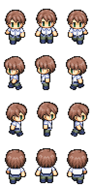
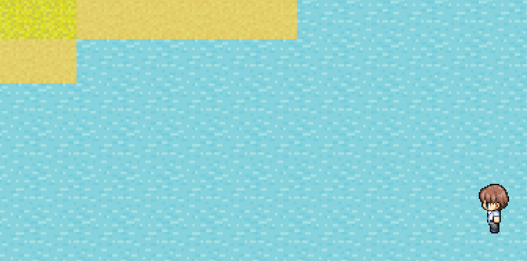
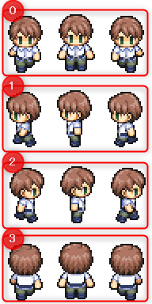
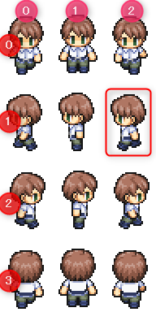
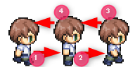

---
var:
  header-title: "Pythonで釣りゲームを作ろう ゲームづくり編4　マップ上を移動しよう"
  header-date: "2024年12月10日（火）"
---

# ゲームづくり編4　マップ上を移動しよう

## キャラクタを動かす

マップ画面を表示するプログラムが完成したので、次はキャラクタを操作してマップ上を移動できるようにしましょう。
今回は、**キャラチップ**と呼ばれる画像を用いてキャラクタの歩行を行います。

<br>

## もくじ
- [](advance04.html#)


## キャラチップとは

**キャラチップ**とは、ゲーム制作においてキャラクターのアニメーションを表現するための、複数のキャラクター画像が並べられた画像です。キャラクターチップとも呼ばれることがあります。




ゲーム内では、プログラムでキャラチップの一部を切り出し、画面上に描画します。今回は、「どの方向を向いているか」に応じてキャラチップの行を、「移動の状態」に応じてキャラチップの列を選択して表示します。

上の画像をダウンロードして`character.png`という名前で`img`フォルダに入れておいてください。

## キャラクターを表示させて移動する

新しいpythonファイル`move01.py`を作成してください。[ここから](https://github.com/k-768/PythonGameProgramming/blob/main/programs/move01.py
)プログラムをコピー＆ペーストして実行してみてください。**WASDでキャラクターが移動します**。このプログラムの要点について解説します。



<br>


```python{.numberLines startFrom=76 caption="move01（抜粋）.py"}
#>>キャラクター>>
CHARA_WIDTH = 64  #キャラの幅
CHARA_HEIGHT = 96 #キャラの高さ

#キャラクターのマップ座標
charaX = 2 
charaY = 2 
charaD = 1  #キャラの向き
flag = "default"
'''
default:通常状態
move:移動中
'''
```

`charaX`と`charaY`は、キャラクターの座標を示す変数です。しかしこれは普通のxy座標ではなく、マップ座標、つまり左上から**何マス目**かを示しています。
`charaD`はキャラクタの方向を示す変数です。下向きが0、左向きが1、右向きが2、上向きが3と、キャラチップの並びと同じ順番になっています。



`flag`は、魚を釣るプログラムでも登場した、場面を管理するためのものです。今回は待機中は`default`、移動中は`move`です。**キーボードの入力は待機中のみ受け付け、移動中は受け付けません**。

<br>

```python{.numberLines startFrom=95 caption="move01（抜粋）.py"}
#移動方向
moveX = 0
moveY = 0
```
`moveX`、`moveY`は移動するマス目を示しています。たとえば、`moveX = -1`なら、**1マス左に移動する**ということになります。

<br>


```python{.numberLines startFrom=99 caption="move01（抜粋）.py"}
#キャラチップを1毎の画像に並べたキャラシートを読み込む
CHARA_SHEET = Image.open(cwd+"/img/character.png")

#読み込んだ画像から縦横何枚ずつチップがあるか求める
CHARA_X = CHARA_SHEET.width // CHARA_WIDTH
CHARA_Y = CHARA_SHEET.height // CHARA_HEIGHT


#キャラチップに分割し2次元配列に格納する
CHARA_CHIP = []
#キャラシートの列数だけ繰り返す
for j in range(CHARA_Y): 
    #新しい行を作成
    row = []
    
    #キャラシートの行数だけ繰り返す
    for i in range(CHARA_X): 
        # キャラクターのチップを切り出して画像を作成
        image = ImageTk.PhotoImage(CHARA_SHEET.crop((
            CHARA_WIDTH * i,               # 左上のX座標
            CHARA_HEIGHT * j,              # 左上のY座標
            CHARA_WIDTH * (i + 1),         # 右下のX座標
            CHARA_HEIGHT * (j + 1)         # 右下のY座標
        )))
        
        # 作成した画像を行に追加
        row.append(image)
    
    # 行をCHARA_CHIPに追加
    CHARA_CHIP.append(row)
```

`99行目`からはキャラチップの画像を、マップチップとほとんど同じ方法で取得しています。
ただし、マップチップはリストに格納していましたが、**キャラチップは2次元リストに格納しています**。


---

- **ChallengeA4-1**　`CHARA_CHIP[1][2]`はどこの部分を指しますか。


回答はコラムの後にあります。

<div class="note type-tips">

**リストの内包表記**

Pythonの便利な文法の一つに**内包表記**というものがあります。**「リストを簡単に作れる書き方」**です。

```python{.numberLines startFrom=1 caption="リストの内包表記"}
CHARA_CHIP = [
    [
        ImageTk.PhotoImage(CHARA_SHEET.crop((
            CHARA_WIDTH * i,
            CHARA_HEIGHT * j,
            CHARA_WIDTH * (i + 1),
            CHARA_HEIGHT * (j + 1)
            ))) for i in range(CHARA_X)
        ]for j in range(CHARA_Y)
    ]
```

```python{.numberLines startFrom=1 caption="リストの内包表記を使わない場合"}
CHARA_CHIP = []
#キャラシートの列数だけ繰り返す
for j in range(CHARA_Y): 
    #新しい行を作成
    row = []
    
    #キャラシートの行数だけ繰り返す
    for i in range(CHARA_X): 
        # キャラクターのチップを切り出して画像を作成
        image = ImageTk.PhotoImage(CHARA_SHEET.crop((
            CHARA_WIDTH * i,               # 左上のX座標
            CHARA_HEIGHT * j,              # 左上のY座標
            CHARA_WIDTH * (i + 1),         # 右下のX座標
            CHARA_HEIGHT * (j + 1)         # 右下のY座標
        )))
        
        # 作成した画像を行に追加
        row.append(image)
    
    # 行をCHARA_CHIPに追加
    CHARA_CHIP.append(row)
```

このように、同じ処理でも簡単に記述できます。リストの内包表記をざっくり説明すると、ループを使ってリストを作るコードを1行にまとめる方法です。しかし、少し理解が難しいので今回は扱いません。気になった方は自分で調べてみてください。

</div>

**<i class="fa-solid fa-check"></i>解答**



<br>

---

プログラムの解説に戻ります。

```python{.numberLines startFrom=150 caption="move01.py（抜粋）"}
#>>ゲームのメインループ関数>>
def gameLoop():
    global charaX,charaY,charaD,moveCount,moveX,moveY,flag,key,currentKey,prevKey
    
    if (len(key)> 0):
        lastKey = key[len(key) - 1] #最後に押されたキー
    else:
        lastKey = ""
    
    
    if (flag == "default"): #待機中のとき 
        
        if(len(key)): #何かのキーが押されているとき
            if(lastKey=="s" or lastKey=="Down"):#下入力
                flag = "move"
                charaD = 0
                moveX = 0
                moveY = 1
                print("↓")
            elif(lastKey=="a" or lastKey=="Left"):#左入力
                flag = "move"
                charaD = 1
                moveX = -1
                moveY = 0
                print("←")
            elif(lastKey=="d" or lastKey=="Right"):#右入力
                flag = "move"
                charaD = 2
                moveX = 1
                moveY = 0
                print("→")
            elif(lastKey=="w" or lastKey=="Up"):#上入力
                flag = "move"
                charaD = 3
                moveX = 0
                moveY = -1
                print("↑")
    
    if (flag == "move"):#移動中のとき
        flag = "default"#待機中に状態を戻す
        charaX += moveX
        charaY += moveY
        #キャラクター再描写
        setChara(charaX,charaY,charaD)
```

ゲームの処理は、関数`gameLoop`内にあります。if文を用いて、**移動用のキーが押されたかを判定**し、**進む方向によって`moveX`と`moveY`を変更**します。また、`flag`を**moveに変更**します。
キーが押されて移動中になったら、今度はキャラクターの位置を進行方向に一つ進んだ位置に変更し、`flag`を**defaultに戻し**ます。今は`flag`が必要ないように感じると思いますが、アニメーションを行う際に必要になります。

これで、作成したマップの上を、キーボードの操作でキャラクターを移動させることができるようになりました。

しかし、直立不動で移動していたり、水の上を歩いていたりと、このままではおかしなところがたくさんあります。


まずは水の上には侵入できないようにしましょう。

## 水の中には入れないようにする

はじめに、各マップチップに対して、入れるかどうかを設定しましょう。
マップのリストの後ろに以下を追加してください。

```python{.numberLines startFrom=67 caption="move02.py（追加）"}
#通行許可設定
#0:不可
#1:可能
PASSAGE_PERMIT = [0,1,1,0]
```

この配列は、`CHIP_DATA`の順番と対応しています。


つまり、マップチップの左から侵入「不可」「可」「可」「不可」となり、草地と砂地は侵入できることになります。

<br>

この設定を使って、**移動する前に**判定を行います。

**!!!!ここから追加する!!!!**と書かれたところからのプログラムを追加してください。
追加する際、インデントに注意してください。

```python{.numberLines startFrom=155 caption="move02.py（追加）"}
def gameLoop():
    global charaX,charaY,charaD,moveCount,moveX,moveY,flag,key,currentKey,prevKey
    
    if (len(key)> 0):
        lastKey = key[len(key) - 1] #最後に押されたキー
    else:
        lastKey = ""
    
    
    if (flag == "default"): #待機中のとき 
        
        if(len(key)): #何かのキーが押されているとき
            if(lastKey=="s" or lastKey=="Down"):#下入力
                flag = "move"
                charaD = 0
                moveX = 0
                moveY = 1
                print("↓")
            elif(lastKey=="a" or lastKey=="Left"):#左入力
                flag = "move"
                charaD = 1
                moveX = -1
                moveY = 0
                print("←")
            elif(lastKey=="d" or lastKey=="Right"):#右入力
                flag = "move"
                charaD = 2
                moveX = 1
                moveY = 0
                print("→")
            elif(lastKey=="w" or lastKey=="Up"):#上入力
                flag = "move"
                charaD = 3
                moveX = 0
                moveY = -1
                print("↑")
            
            #!!!!ここから追加する!!!#

            #上の処理で移動中フラグが立ったとき
            if(flag == "move"):
                #移動先が通行可能でないならば
                if(not PASSAGE_PERMIT[MAP_DATA[charaY+moveY][charaX+moveX]]):
                    #移動をやめて向きのみ変える
                    flag = "default"
                    moveX = 0
                    moveY = 0
                    setChara(charaX,charaY,charaD)
```

`MAP_DATA[charaY+moveY][charaX+moveX]`が移動する先のマップの情報(1なら草地、2なら砂地...)です。それを`PASSAGE_PERMIT`に入れることで、**移動先のマップチップが、上を歩ける種類かどうか判定できます**

移動先が侵入できない場合、`flag`を**defaultに戻します**。


## キャラクターをアニメーションさせる





