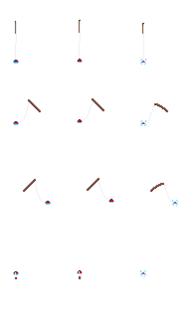
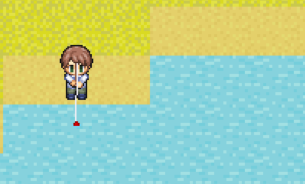

---
var:
  header-title: "Pythonで釣りゲームを作ろう ゲームづくり編4　ゲームを完成させよう"
  header-date: "2024年12月15日（日）"
---

# ゲームづくり編4　ゲームを完成させよう

今回は、ゲームにとって欠かせないセーブ機能を実装しましょう。そして、釣りのシステムと移動のシステムを組み合わせて、釣りゲームを完成させましょう。

<br>

## もくじ

- [JSONとは](advance04.html#JSONとは)
- [JSONを書く](advance04.html#JSONを書く)
- [JSONを読み込む](advance04.html#JSONを読み込む)
- [JSONを書き込む](advance04.html#JSONを書き込む)
- [釣りができるかどうか判定する](advance04.html#釣りができるかどうか判定する)
- [全体の組み立て](advance04.html#全体の組み立て)
- [最後に](advance04.html#最後に)


## JSONとは

今回は、ゲームの進行状況を保存するために JSON（JavaScript Object Notation） を用います。釣った魚の情報やキャラクターの位置、レベルなどを保存するのに使います。JSONはPythonで簡単に操作できるため、初心者にも扱いやすいのが特徴です。**リストや辞書型に似た形式で、Pythonのリストや辞書型と相互変換が可能**です。

## JSONを書く

**これがJSONファイルです**。Pythonと同じような感覚で記述することができます。
それぞれのデータの意味は以下のようになっています。本来は、イワシの後にサバやアジ、...、タイと続きますが、長くなるので省略します。

```json{.numberLines startFrom=1 caption="savedata.json（解説付き）"}
{
    "イワシ": {
        "count": 0, //イワシを釣った回数
        "maxWeight": 0, //釣ったイワシの最大重量
        "bronze": false, //ブロンズランクのイワシを釣ったことがあるか
        "silver": false, //シルバーランクのイワシを釣ったことがあるか
        "gold": false, //ゴールドランクのイワシを釣ったことがあるか
        "totalWeight": 0 //釣ったイワシの累計重量
    },
    "money": 0,//所持金
    "x": 3,//キャラクターのマップx座標
    "y": 3,//キャラクターのマップy座標
    "d": 0,//キャラクターの向き
    "lv": 0//キャラクターのレベル
}
```

## JSONを読み込む

`save_load.py`という名前で新しいファイルを作成してください。

```python{.numberLines startFrom=1 caption="save_load.py"}
import json
import os

cwd = os.getcwd()  # カレントディレクトリ取得

try:
    with open(cwd + "/savedata.json") as f:
        saveData = json.load(f)
    print("セーブデータを読み込みました:", saveData)
except:
    saveData = {
        "イワシ": {
            "count": 0,
            "maxWeight": 0,
            "bronze": False,
            "silver": False,
            "gold": False,
            "totalWeight": 0
        },
        "money": 0,
        "x": 3,
        "y": 3,
        "d": 0,
        "lv": 0
    }
    print("新しいセーブデータを作成しました。")
```

ここで、新しい構文、`try-except構文`について説明します。

Pythonの`try-except構文`は、プログラム実行中に発生する**エラーに対処するための仕組み**です。この構文を使うことで、**プログラムがエラーで突然終了するのを防ぎ、エラー時に適切な処理を実行でき**ます。

```python{.numberLines startFrom=1 caption="try-except構文"}
try:
    # エラーが発生する可能性がある処理
except エラーの種類:
    # エラーが発生した場合の処理
```

今回の場合は、`try:`で`savedata.json`を**開きます**。これにより、もしセーブデータがあれば**セーブデータを読み込み（コンティニュー）**ます。もしセーブデータがなければ、`savedata.json`ファイルを開くことができず、エラーが発生します。そのとき、ファイルを開くのをやめ、**新しいファイルを作成（ニューゲーム）**します。

<br>

## JSONを書き込む

以下のプログラムを実行すると、`savedata.json`の`money`が100に書き換えられます。

```{.numberLines startFrom=1 caption="save_load.py"}
import json
import os

# カレントディレクトリ取得
cwd = os.getcwd()

# セーブデータを読み込み
try:
    with open(cwd + "/savedata.json") as f:
        saveData = json.load(f)
    print("セーブデータを読み込みました:", saveData)
except:
    # セーブデータがない場合は新しいデータを作成
    saveData = {
        "イワシ": {
            "count": 0,
            "maxWeight": 0,
            "bronze": False,
            "silver": False,
            "gold": False,
            "totalWeight": 0
        },
        "money": 0,
        "x": 3,
        "y": 3,
        "d": 0,
        "lv": 0
    }
    print("新しいセーブデータを作成しました。")

# セーブ機能を追加
def saveGame():
    global saveData
    # JSONファイルにデータを保存
    try:
        with open(cwd + "/savedata.json", 'w') as f:
            json.dump(saveData, f, indent=2)
        print("セーブデータを保存しました。")

# データの変更
saveData["money"] = 100  # moneyを100に変更

# データを保存
saveGame()

```

```{.numberLines startFrom=1 caption="json_write.py"}
with open(cwd + "/save/savedata.json", 'w') as f:
    json.dump(saveData, f, indent=2)
```

1行目の`cwd+"/savedata.json"`は保存するファイルパスを指定しています。'w'は「書き込みモード」を意味します。既存のファイルがあれば上書きされます。

2行目の`json.dump():`でsaveDataをJSON形式に変換し、ファイルに保存します。indent=2でファイルの内容が見やすくインデントされます。

<br>

## 釣りができるかどうか判定する

そのまま釣りのシステムと移動のシステムを組み合わせると、想定外の動作が発生することがあります。 **キャラクターがどこでも釣りをできる状態となり、陸地でも釣りが可能になってしまいます**。

そこで、キャラクターの**目の前が水である場合のみ**釣りができるようにしましょう。そのために、**釣りができるか判定する関数**を作成します。

新しいpythonファイル`move_check.py`を作成してください。[ここから](https://github.com/k-768/PythonGameProgramming/blob/main/programs/move_check.py
)プログラムをコピー＆ペーストして実行してみてください。

水辺に到達すると頭上に**釣りアイコン**が表示されます。


<br>

---

まず、このプログラムにおいて釣りが可能なマップチップを指定するリスト`FISHING_PERMIT`を用意します。このリストは、各マップチップが釣り可能かどうかを判定するために使用されます。

```python{.numberLines startFrom=72 caption="move_check.py（抜粋）"}
#釣り可能設定
#0:不可
#1:可能
FISHING_PERMIT = [0,0,0,1]
```

リストのインデックスは、`MAP_DATA` の値に対応しています。
各インデックスの値が0なら、**このマップチップでは釣りができない**、1なら**このマップチップで釣りが可能**であることを示しています。今回は、`FISHING_PERMIT[3]`のみ**1**、つまりマップチップIDが3の**水**タイルでのみ釣りが可能だということになります。

---

`110行目`からの関数で、**キャラクターの目の前のタイルが釣り可能かどうかを判定し、釣りアイコンを表示**します。

```python{.numberLines startFrom=110 caption="move_check.py（抜粋）"}
#前のタイルが釣り可能ならば釣りアイコンを表示する関数
def setFishingIcon(x,y,d):
    """
    x:キャラのx座標
    y:キャラのy座標
    d:キャラの向き
    """
    global fishFlag
    
    if d == 0:#下向き
        moveX = 0
        moveY = 1
    elif d == 1:#左向き
        moveX = -1
        moveY = 0
    elif d == 2:#右向き
        moveX = 1
        moveY = 0
    elif d == 3:#上向き
        moveX = 0
        moveY = -1
    
    
    # 移動先がマップ範囲内ならば
    if 0 <= y+moveY < len(MAP_DATA) and 0 <= x+moveX < len(MAP_DATA[0]):
        #前のマスが釣り可能ならば
        if FISHING_PERMIT[MAP_DATA[y+moveY][x+moveX]]:
            setIcon(x,y,"fishing")
            print(f"you can fishing @({x+moveX},{y+moveY})")
            fishFlag = True
        else:
            fishFlag = False
    else:
        # 移動先がマップ範囲外
        fishFlag = False
```

順を追って解説します。

---

まず、キャラクターの目の前のタイルを計算します。

```python{.numberLines startFrom=119 caption="move_check.py（抜粋）"}
if d == 0:  # 下向き
    moveX = 0
    moveY = 1
elif d == 1:  # 左向き
    moveX = -1
    moveY = 0
elif d == 2:  # 右向き
    moveX = 1
    moveY = 0
elif d == 3:  # 上向き
    moveX = 0
    moveY = -1
```

キャラクターの向き (d) に応じて、目の前のタイルの相対座標 (moveX, moveY) を決定します。例えば、右向き(d == 2)の場合、moveX = 1, moveY = 0 となり、目の前は x+1, y のタイルとなります。

---

```python{.numberLines startFrom=134 caption="move_check.py（抜粋）"}
if 0 <= y + moveY < len(MAP_DATA) and 0 <= x + moveX < len(MAP_DATA[0]):
```
目の前のタイルがマップ範囲内であることを確認します。範囲外の場合は何もしません。

---

次の行で釣り可能なタイルか判定しています。

```python{.numberLines startFrom=135 caption="move_check.py（抜粋）"}
if FISHING_PERMIT[MAP_DATA[y + moveY][x + moveX]]:
    setIcon(x, y, "fishing")
    print(f"you can fishing @({x+moveX},{y+moveY})")
    fishFlag = True
else:
    fishFlag = False
```

`MAP_DATA[y + moveY][x + moveX]`で目の前のマップチップのID（種類）を取得しています。
このタイルIDに対応する`FISHING_PERMIT`の値を確認し、`1`なら釣りが可能だということになります。

<br>

釣り可能であれば釣りアイコンを表示します。また、状態フラグ`fishFlag`を**True**に設定します。後に**このフラグがTrueのときのみ釣りを開始できる**ようにします。

目の前のタイルが釣り不可、または範囲外の場合は`fishFlag`を**False**に設定します。


**移動するたびにこの関数を呼び出して、釣りができるかどうかを判定しています。**

<br>

## 全体の組み立て

今までのプログラムを組み合わせて、いよいよゲームの完成です。

釣りシステムの作成では、キャラクタの向きは固定でした。しかし、今度は釣りをする画像も4方向分が必要になります。以下の`rod.png`と`character_wait.png`を`img`フォルダに保存してください。




---

システム全体の状態遷移図は以下のようになります。プログラムと照らし合わせながら動作を確認してみてください。


---

新しいpythonファイル`game.py`を作成してください。[ここから](https://github.com/k-768/PythonGameProgramming/blob/main/programs/game.py
)プログラムをコピー＆ペーストして実行してみてください。矢印キーで移動し、水辺でスペースキーを押すことで釣りを開始できます。また、右上にはレベルや所持金を表示させています。



---

<br>

## 最後に

長時間お疲れさまでした。ここまで学習を進めて、釣りゲームを完成させることができました。この過程で、Pythonプログラミングの基本身に着けることができたはずです。

ここからは、完成した釣りゲームを改造して、カスタマイズしてみてください。自分で考えてプログラミングをすることで、学んだことを定着できます。いくつか改造案を示します。

- 魚の種類を増やしてみる
- レベルや所持金の見た目を整える
- 新しいステージを追加する
- 季節や時間帯の概念を追加する
- 釣れる魚が場所や時間で変わるようにする
- 餌や釣り竿、針などを強化できるようにする

また、このゲームで学んだ技術は、他のジャンルのゲームやアプリ開発にも応用できます。シューティングゲームやパズルゲームなど、自分の作りたいゲームづくりに挑戦してみてください。

<br>

最後までこの教材を活用いただき、本当にありがとうございます。この教材が、皆さんの新たな一歩を支えるきっかけとなれば幸いです。