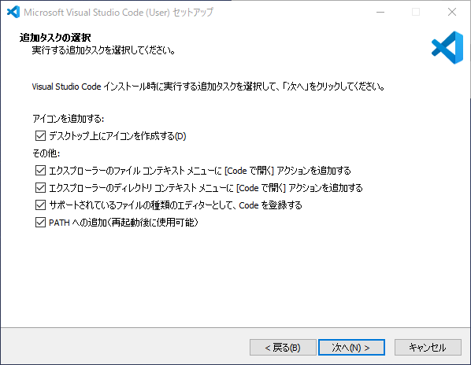
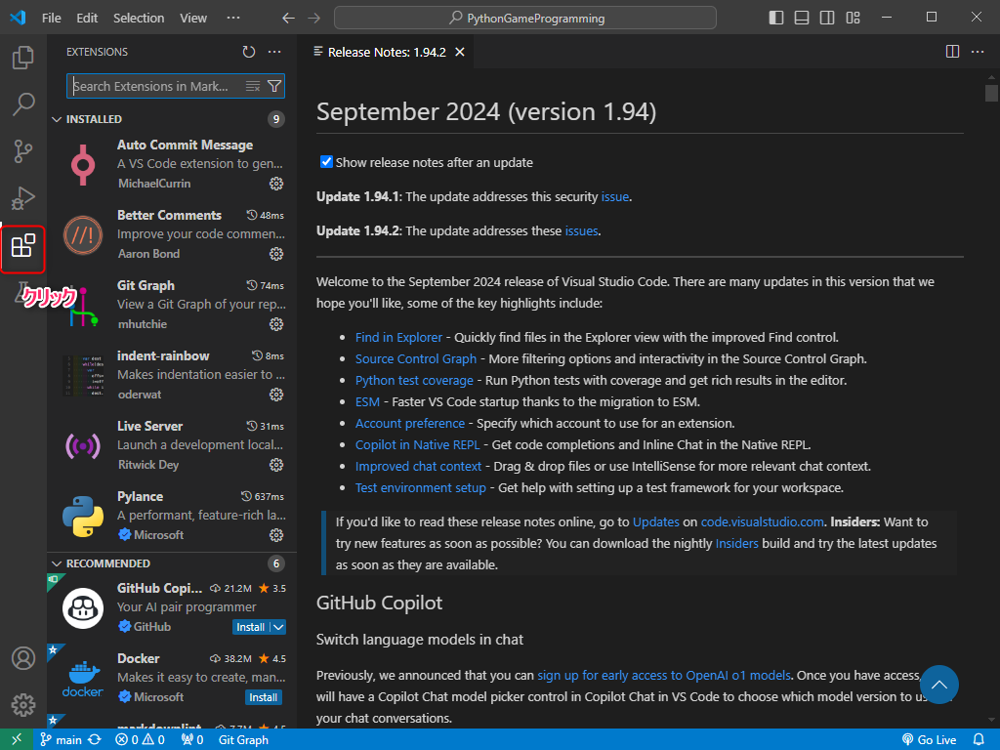
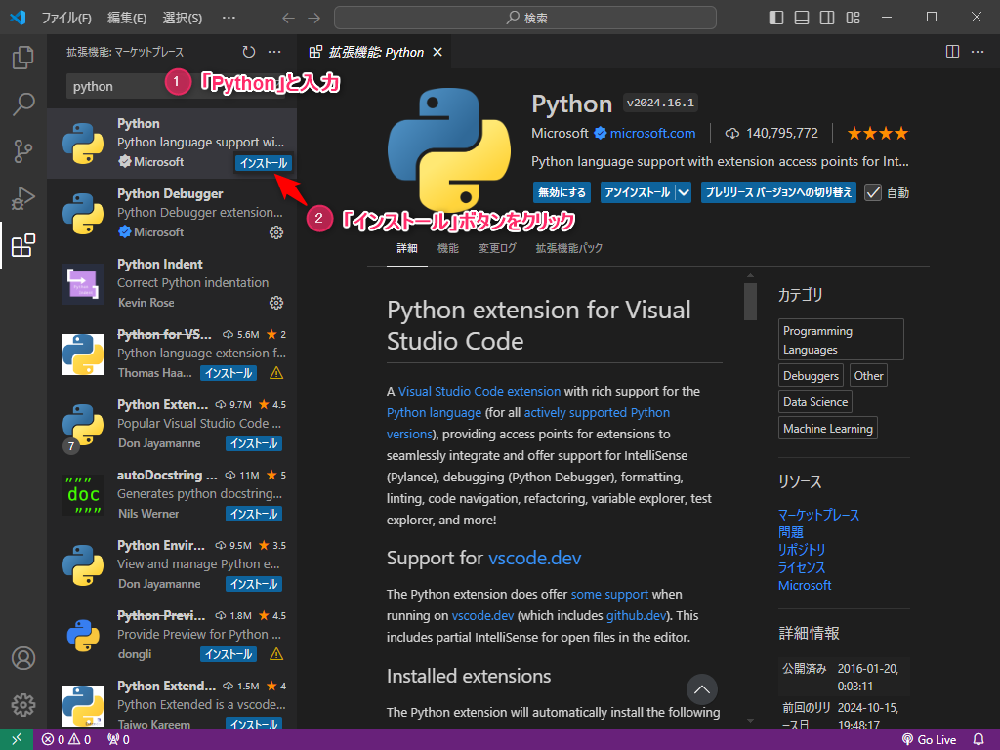

---
var:
  header-title: "Pythonで釣りゲームを作ろう 基礎編1　環境構築"
  header-date: "2024年10月15日（火）"
---

# 基礎編1　環境構築 


## はじめに

このオンラインテキストでは、**釣りゲームづくりを通じて、Pythonプログラミングを学ぶことができます**。
**90分x8回**の講座で、テキストを進めると**最終的にゲームが完成する**形式です。


## もくじ

-  [Pythonのインストール](basic01.html#Pythonのインストール) 
-  [VS Codeのインストール](basic01.html#VSCodeのインストール) 
-  [プログラムの実行](basic01.html#プログラムの実行) 

## Pythonのインストール

### Windows の場合

以下の手順に従ってPythonをインストールしてください。

- [公式サイト](https://www.python.org/downloads/)から、インストーラをダウンロードする


<br>

- ダウンロードしたファイルを開く

- 一つ目の選択肢にチェックを入れて実行


<br>

- `Close`をクリックして終了


<br>

### Mac の場合

Macの場合は[このサイト](https://gammasoft.jp/blog/python-install-and-code-run/)に従ってインストールしてください。


## VSCodeのインストール

レポートを書くためにWordやGoogleDocumentといったテキストエディタが必要であるのと同じように、**プログラミングにはソースコードエディタが必要**です。今回は、**Visual Studio Code**(VSCode)とよばれるソースコードエディタを用います。

- [公式サイト](https://code.visualstudio.com/)から、インストーラをダウンロードする


<br>

- ダウンロードしたファイルを開く

- この画面が出るまで`次へ`をクリック



<br>

- **全部の**選択肢にチェックを入れて`次へ`をクリック

- `インストール`をクリックしてしばらく待つ


<br>

- `完了`を押す

---

VSCodeが立ち上がったら、設定を行います。

- 左側のサイドバーから以下のアイコンをクリック



<br>

- 日本語拡張機能を以下の手順で導入

**①**検索欄に「**japan**」と入力し、**②**候補の中から「Japanese Language Pack for Visual Studio Code」をインストール


<br>

インストールが完了すると、**右下にポップアップが表示されるので、「Restart」をクリック**


<br>

日本語で表示されれば**成功です!!**


<br>

---

- 同じ手順でPython拡張機能を導入

**①**検索欄に「**python**」と入力し、**②**候補の中から「Python」をインストール



<br>

- VSCodeの再起動

インストールが完了したら、右上の「×」を押してVSCodeを閉じてください。


## プログラムの実行

実際にプログラムを書いて、動かしてみます。

- 新しいファイルを作成

**①**左側の`エクスプローラ`内で右クリックして、**②**`新しいファイル`を選択、`hello.py`という名前で新しいファイルを作成


<br>

<div class="note type-tips">

**拡張子**

作成したファイルの名前に注目して下さい。

```
hello.py
```
**.**(ドット)より後ろの部分のことを**拡張子**と呼びます。
拡張子は**ファイルの種類を識別するため**にあり、`.py`の場合は**pythonがかかれたファイルである**ことを示しています。

**画像**であれば`.png`や`.jpeg`、**動画**であれば`.mp4`や`.avi`などの形式が広く使用されています。

</div>

---

- プログラムを記述

右側の画面にプログラムを記述します。以下のコードを入力してください。

```python{.numberLines caption="hello.py"}
print("Hello World!!")
```


入力が終わったら`Ctrl+S`を押してください。**保存されます**。

<br>

- プログラムの実行

プログラムを入力できたら、`▷`を押してください。プログラムが実行されます。


図のように、`Hello World!!`と表示されていたら成功です!


これで**環境構築は完了**です。少し休憩して次のステップに進みましょう。

## 参考文献

[環境構築について](https://gammasoft.jp/blog/how-to-start-visual-studio-code-for-python/)