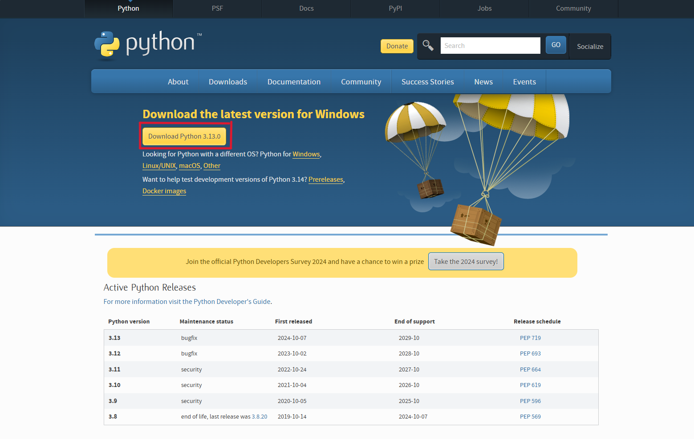
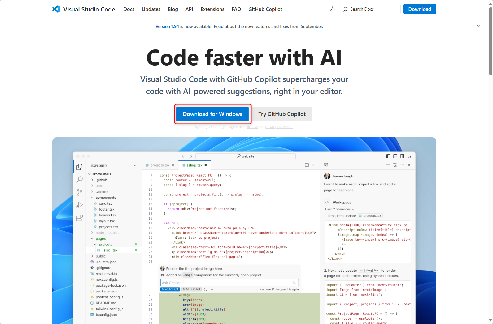
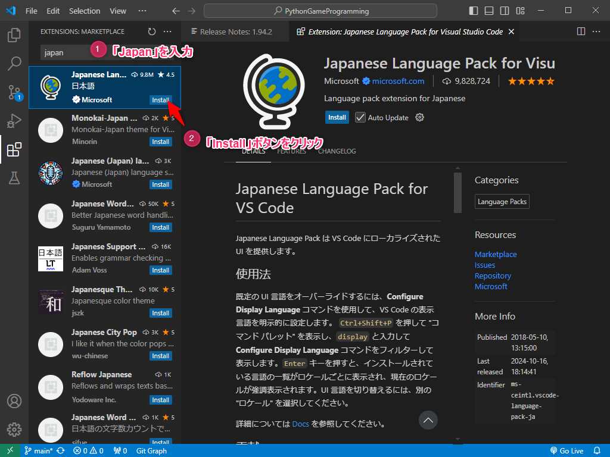

---
var:
  header-title: "Pythonで釣りゲームを作ろう 基礎編1　環境構築"
  header-date: "2024年10月15日（火）"
---

# 基礎編1　環境構築 

## はじめに

このオンラインテキストでは、**釣りゲームづくりを通じて、Pythonプログラミングを学ぶことができます**。
**90分x8回**の講座で、テキストを進めると**最終的にゲームが完成する**形式です。

## もくじ

-  [Pythonのインストール](basic01.html#Pythonのインストール) 
-  [VS Codeのインストール](basic01.html#VSCodeのインストール) 
-  [プログラムの実行](basic01.html#プログラムの実行) 

## Pythonのインストール

### Windows の場合

以下の手順に従ってPythonをインストールしてください。

- [公式サイト](https://www.python.org/downloads/)から、インストーラをダウンロードする

 

- ダウンロードしたファイルを開く

- 一つ目の選択肢にチェックを入れて実行

 

- `Close`をクリックして終了

 

### Mac の場合

Macの場合は[このサイト](https://gammasoft.jp/blog/python-install-and-code-run/)に従ってインストールしてください。

## VSCodeのインストール

レポートを書くためにWordやGoogleDocumentといったテキストエディタが必要であるのと同じように、**プログラミングにはソースコードエディタが必要**です。今回は、**Visual Studio Code**(VSCode)とよばれるソースコードエディタを用います。

- [公式サイト](https://code.visualstudio.com/)から、インストーラをダウンロードする

 

- ダウンロードしたファイルを開く

- この画面が出るまで`次へ`をクリック

 

- **全部の**選択肢にチェックを入れて`次へ`をクリック

- `インストール`をクリックしてしばらく待つ

 

- `完了`を押す

---

VSCodeが立ち上がったら、設定を行います。

- 左側のサイドバーから以下のアイコンをクリック

 

- 日本語拡張機能を以下の手順で導入

**①**検索欄に「**japan**」と入力し、**②**候補の中から「Japanese Language Pack for Visual Studio Code」をインストール

 

インストールが完了すると、**右下にポップアップが表示されるので、「Restart」をクリック**

 

日本語で表示されれば**成功です!!**

 

---

- 同じ手順でPython拡張機能を導入

**①**検索欄に「**python**」と入力し、**②**候補の中から「Python」をインストール

 

- VSCodeの再起動

インストールが完了したら、右上の「×」を押してVSCodeを閉じてください。

これで**環境構築は完了**です。少し休憩して次のステップに進みましょう。

## プログラムの実行

## 参考文献

[環境構築について](https://gammasoft.jp/blog/how-to-start-visual-studio-code-for-python/)