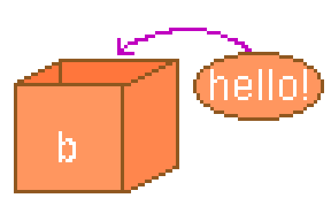

---
var:
  header-title: "Pythonで釣りゲームを作ろう 基礎編2　変数"
  header-date: "2024年04月23日（月)"
---

# 基礎編2　変数 

## もくじ

-  [変数とは](basic02.html#変数とは) 
-  [変数の値を変更する](basic02.html#変数の値を変更する) 
-  [変数の命名](basic02.html#変数の命名) 


## 変数とは


変数とは、**データを入れておく箱**のようなもので、箱の中身は**いつでも確認したり変更することができます**。
変数`a`に値`10`を入れるときは、以下のように書きます。


```python
a = 10
```
この変数に値を入れる`=`は、**代入演算子**と呼ばれます。

</br>

---

変数に入れた値は、**簡単に**取り出すことができます。print文の`()`の中に変数名を記述するだけです。

```python{.numberLines caption="test2-1.py"}
a = 10
print(a)
```
**<i class="fa-solid fa-terminal"></i> 実行結果**

```
10
```

1行目で変数`a`に10を代入しています。そのため、2行目のprint文の`()`の中の`a`は10と読み替えられました。

<br>
<div class="note type-tips">

**「=」の使い方に注意!!**

代入演算子`=`は、**数学で使うものとは意味が異なり、左の変数に右の値を代入するはたらき**を持ちます。
そのため、以下のプログラムを実行するとエラーが起きます。

```python{.numberLines caption="test.py"}
10 = a
print(a)
```
**<i class="fa-solid fa-terminal"></i> 実行結果**

```
PS C:\******> & C:/******/python.exe c:/******/test.py
  File "c:\******\test.py", line 1
    10 = a
    ^^
SyntaxError: cannot assign to literal here. Maybe you meant '==' instead of '='?
```

「`10`は**変数ではないので代入できません**」と言われてしまいます。


</div>

---



もちろん、変数には**文字列も代入できます**。文字列の場合は、**`"`で囲う**のでしたね。
これは「hello」と書くと**変数とみなされてしまう**ので、**変数と区別するため**だったわけです。


</br>

```python{.numberLines caption="test2-2.py"}
b = "hello!"
print(b)
```

**<i class="fa-solid fa-terminal"></i> 実行結果**

```
hello!
```

</br>

## 変数の値を変更する

変数に代入し直せば、変数の値を変更することができます。

```python{.numberLines caption="test2-3.py"}
a = 10
print(a)
a = 20
print(a)
```
**<i class="fa-solid fa-terminal"></i> 実行結果**

```
10
20
```

<br>

---

**`a = a + 2`と書けば、`a`の値を2だけ増やすことができます**。


```python{.numberLines caption="test2-3.py"}
a = 10
print(a)
a = a + 2
print(a)
```
**<i class="fa-solid fa-terminal"></i> 実行結果**

```
10
12
```

- **Challenge2-1**　上のプログラムの1行目を書き換えて、`a`の値を`123`に変更しましょう。
- **Challenge2-2**　3行目を書き換えて、`a`の値を**2倍**にするよう変更しましょう。