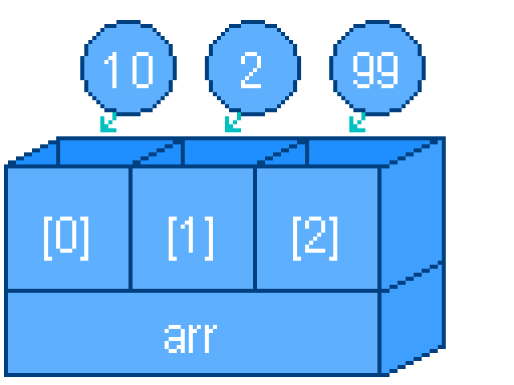

---
var:
  header-title: "Pythonで釣りゲームを作ろう 基礎編5　if文"
  header-date: "2024年04月23日（月)"
---

# 基礎編5　if文 

## もくじ

-  [比較演算子](basic05.html#比較演算子) 
-  [2次元リスト](basic05.html#2次元リスト) 

## 比較演算子

リストは、**変数をセットで管理できる便利なもの**です。
例えば、以下のようにキャラクターの持ち物を表すことを考えましょう。