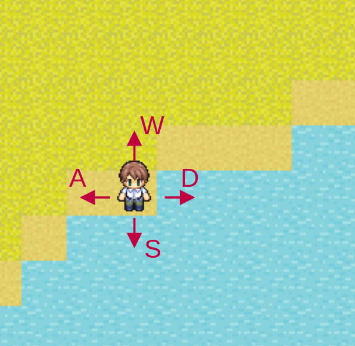

---
var:
  header-title: "Pythonで釣りゲームを作ろう 基礎編5　if文"
  header-date: "2024年04月23日（月)"
---

# 基礎編5　if文 

---

if文を使えば、条件分岐をつくることができます。**条件分岐なしにはゲームはつくれません**。
たとえば、RPGでは押したボタンによって攻撃したり、技を使ったり、逃げたりと、様々な分岐があります。
プレイヤーが行動を選択できなければ、ただのアニメーションですからね。

## もくじ

-  [条件分岐とは](basic05.html#条件分岐とは) 
-  [if文](basic05.html#if文) 
-  [関係演算子](basic05.html#関係演算子)
-  [if-else文](basic05.html#if-else文) 
-  [if-elif文](basic05.html#if-elif文) 

## 条件分岐とは



RPGのマップ移動を例に考えてみましょう。キーボード入力によって進む方向が変わります。


- Wキー　→　上に進む
- Aキー　→　左に進む
- Sキー　→　下に進む
- Dキー　→　右に進む

このようにゲームでは様々な条件によって処理を変更しています。Pythonでは、`if文`を用いて条件分岐を記述します。

## if文

`if文`の構造を見ていきましょう。

```python{.numberLines caption="if文の構造"}
if a > 0:
  print("aは正の値です")
```

1行目`if`と`:`に囲まれた部分が**条件を示す部分**です。この例では、「aが0以上」になります。

そして、2行目は、**1行目の条件を満たした時実行される部分**です。**インデント**([参照](basic04.html#インデント))する必要があります。

インデントした部分を**ブロック**と言い、条件を満たした時、すぐ後ろのブロックが**全て実行されます**。

```python{.numberLines caption="ブロック"}
if 条件:
  処理A
  処理B
  処理C
  ...
```
以下のプログラムを実行してみましょう。

```python{.numberLines caption="test5-1.py"}
a = 1
b = -1
if a > 0: # a>0であれば
  print("aは正の値です")
  print("a:"+str(a))

if b > 0: # b>0であれば
  print("bは正の値です")
  print("b:"+str(b))
```

**<i class="fa-solid fa-terminal"></i> 実行結果**

```
aは正の値です
a:1
```


## 関係演算子

関係演算子は以下のような種類があります。

-----------------------
演算子 記述例 意味 
---- ------ --------------
==   a==b   aとbが等しい 

!=   a!=b   aとbが等しくない(≠) 

>    a>b    aがbより大きい 

<    a<b    aがbより小さい 

>=   a>=b   aがb以上 

<=   a<=b   aがb以下
----------------------- 

## if-else文

`else`を用いて、**条件が満たされなかったときの処理を設定する**ことができます。

```python{.numberLines caption="if-else文の構造"}
import random
weight = random.randint(10,50)/10 #1.0から5.0までの乱数
if weight > 3: # weight>3であれば
  print(str(weight)+"kgの大物が釣れた！")
else: # weight>3でなければ
  print(str(weight)+"kgの魚が釣れた！")
```

- `weight`が3より大きいとき、条件を満たすので、「XXkgの大物が釣れた！」と出力されます。
- `weight`が3以下のとき、条件を満たさないので、「XXkgの魚が釣れた！」と出力されます。

---

`if-else文`を入れ子にすることで、**細かく条件を設定する**ことができます。

```python{.numberLines caption="if-else文の入れ子"}
import random
weight = random.randint(10,50)/10 #1.0から5.0までの乱数
if weight > 4: # weight>4であれば
  print(str(weight)+"kgの超大物が釣れた！")
else: # weight>4でなければ
  if weight > 3: # weight>3であれば
    print(str(weight)+"kgの大物が釣れた！")
  else: # weight>3でなければ
    print(str(weight)+"kgの魚が釣れた！")
```

もっと細かく条件を分けたければ、もっと**if文を入れ子にすれば良い**わけです。
しかし、それではどんどんプログラムが複雑になってしまいます。
入れ子が増えた構造は**ネスト**とよばれ、わかりやすいプログラムにするためには**なるべくネストを避ける工夫が必要**です。
このような処理を行いたい際には次の**if-elif文**を用います。

## if-elif文

`elif`を用いて上のプログラムをもっとスマートに書くことができます。

```python{.numberLines caption="if-elif文の構造"}
import random
weight = random.randint(10,50)/10 #1.0から5.0までの乱数
if weight > 4: # weight>4であれば
  print(str(weight)+"kgの超大物が釣れた！")
elif weight > 3: # weight>3であれば
  print(str(weight)+"kgの大物が釣れた！")
else: # weight>3でなければ
  print(str(weight)+"kgの魚が釣れた！")
```


<div class="note type-tips">

**if文とif-elif文の違い**

下の二つのプログラムを実行して、違いを確認しましょう。
```python{.numberLines caption="if文"}
weight = 4.5 
if weight > 4: # weight>4であれば
  print(str(weight)+"kgの超大物が釣れた！")
if weight > 3: # weight>3であれば
  print(str(weight)+"kgの大物が釣れた！")
```

```python{.numberLines caption="elif文"}
weight = 4.5
if weight > 4: # weight>4であれば
  print(str(weight)+"kgの超大物が釣れた！")
elif weight > 3: # weight>3であれば
  print(str(weight)+"kgの大物が釣れた！")
```

---

**<i class="fa-solid fa-terminal"></i> 実行結果(if文)**

```
4.5kgの超大物が釣れた！
4.5kgの大物が釣れた
```

**<i class="fa-solid fa-terminal"></i> 実行結果(elif文)**

```
4.5kgの超大物が釣れた！
```


**if文**の場合、条件が複数満たされると、**それぞれの処理が実行**されます。

一方で**if-elif文**の場合、**最初に満たされた条件の処理だけが実行され、その後の条件は無視**されます。

これらの動作を図解すると以下のようになります。

**if文の場合**


**elif文の場合**


この図は**状態遷移図**と呼ばれ、**プログラムの構造を理解する際に役に立ち**ます。

</div>

<br>

`if-elif文`が用いられる代表的な例としては、**キーボードによるキャラクター移動**が挙げられます。

```python{.numberLines caption="move.py"}
key = "w"
if key == "w":
  print("奥に進みます")
elif key == "a":
  print("左に進みます")
elif key == "s":
  print("手前に進みます")
elif key == "d":
  print("右に進みます")
else: 
  print("不正な入力です")
```

## 論理演算子

条件分岐をする際に、もう一つ重要になるのが論理演算子です。複数の条件を記述する際に用います。
論理演算子は以下のような種類があります。


<table>
<thead>
    <tr>
      <th scope="col">演算子</th>
      <th scope="col">記述例</th>
      <th scope="col">意味</th>
    </tr>
  </thead>
  <tbody>
    <tr>
      <th scope="row">and</th>
      <td>a>b and a>c</td>
      <td>　a>b **かつ** a>c </td>
    </tr>
    <tr>
      <th scope="row">or</th>
      <td>a>b or a>c</td>
      <td>　a>b **または** a>c </td>
    </tr>
    <tr>
      <th scope="row">not</th>
      <td>not a>b</td>
      <td> 　a>b **でない**</td>
    </tr>
  </tbody>
</table>

### andを用いる例

ゲームにおける買い物を例に考えます。

**アイテム**：丈夫な釣り竿
**価格**：500
**プレイヤーのレベル制限**：20

この場合、以下の条件を**どちらも**満たす必要があります。

- 所持金が500以上
- プレイヤーのレベルが20以上

すなわち、以下のようになります。

```python{.numberLines caption="ex_and.py"}
level = 25 #プレイヤーのレベル
money = 999 #所持金

if money >= 500 and level >= 20:
  print("丈夫な釣り竿を手に入れた！")
```

### orを用いる例

キーボードによるキャラクター移動を**WASDと矢印キー**両方に対応できます。

```python{.numberLines caption="ex_or.py"}
key = "w"
if key == "w" or key =="Up":
  print("奥に進みます")
elif key == "a" or key =="Left":
  print("左に進みます")
elif key == "s" or key =="Down":
  print("手前に進みます")
elif key == "d" or key =="Right":
  print("右に進みます")
else: 
  print("不正な入力です")
```


#### **charenge5** 

先ほどのプログラムを改造してみましょう。新しいファイル`charenge5.py`を作成してください。

**アイテム**：丈夫な釣り竿
**価格**：500
**プレイヤーのレベル制限**：20

```python{.numberLines caption="charenge5.py"}
level = 25 #プレイヤーのレベル
money = 999 #所持金

if money >= 500 and level >= 20:
  print("丈夫な釣り竿を手に入れた！")
# ここに条件を追加する
```

次の課題に挑戦してください。できたと思ったら**所持金を200に変えて実行してみて**正しく動作するか確認してください。

- **5-1** elifを用いて、所持金が足りなければ`所持金が足りません`というメッセージを表示させる。

- **5-2** 所持金が足りなければ、足りない金額を計算して、`所持金がxx円足りません`というメッセージを表示させる

　**ヒント1**不足金額の計算方法:　<span class="masked">不足金額 = 500 - money</span>

　**ヒント2**メッセージの結合:　<span class="masked">文字列は`+`を用いて結合できます</span>

　**ヒント3**数値を文字列に変換:　<span class="masked">str()関数で数値を文字列に変換できます</span>


**スクロールして答えを確認してください**

---

<br><br><br><br><br><br><br>

---

```python{.numberLines caption="5-1答え"}
level = 25 #プレイヤーのレベル
money = 200 #所持金

if money >= 500 and level >= 20:
  print("丈夫な釣り竿を手に入れた！")
elif money < 500:
  print("所持金が足りません")
```

```python{.numberLines caption="5-2答え"}
level = 25 #プレイヤーのレベル
money = 200 #所持金

if money >= 500 and level >= 20:
  print("丈夫な釣り竿を手に入れた！")
elif money < 500:
  print("所持金が"+str(500-money)+"円足りません")
```