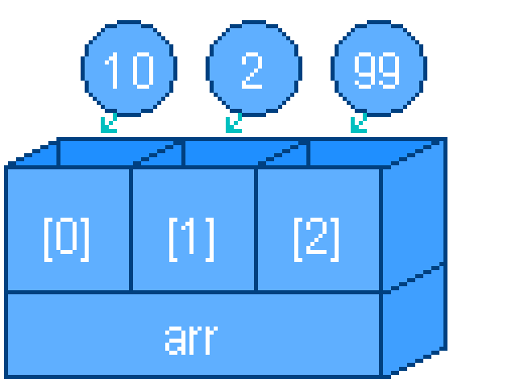

---
var:
  header-title: "Pythonで釣りゲームを作ろう 基礎編7　リスト"
  header-date: "2024年04月23日（月)"
---

# 基礎編7　リスト 

## もくじ

-  [リストとは](basic07.html#リストとは) 
-  [2次元リスト](basic07.html#2次元リスト) 

## リストとは



リストは、**変数をセットで管理できる便利なもの**です。
例えば、以下のようにキャラクターの持ち物を表すことを考えましょう。

```python{.numberLines}
item1 = "伝説の釣り竿"
item2 = "大容量のバケツ"
item3 = "丈夫な釣り糸"
item4 = "大きな釣り針"
item5 = "高級な釣り餌"
```

これを、リストを使うとスマートに記述できます。

```python{.numberLines}
items = ["伝説の釣り竿","大容量のバケツ","丈夫な釣り糸","大きな釣り針","高級な釣り餌"]
```
<br>

ここで、`items`がリストであり、`,`で区切られた一つ一つを**要素**と言います。

---


図の`[0]`や`[1]`の番号を**インデックス**と呼び、**住所でいえば番地のようなもの**です。
リストの各要素を取り出したいときは、以下のようにインデックスで指定します。

<br>

```python{.numberLines}
items = ["伝説の釣り竿","大容量のバケツ","丈夫な釣り糸","大きな釣り針","高級な釣り餌"]
print(items[0])
print(items[1])
print(items[2])
```

**<i class="fa-solid fa-terminal"></i> 実行結果**

```
伝説の釣り竿
大容量のバケツ
丈夫な釣り糸
```
<br>

<div class="note type-tips">

**いちばん初めの要素のインデックスは、`1ではなく0`である点に注意!!**

</div>

<br>

---

また、リストに含まれる要素の数を**要素数**と言い、`len()`を使ってその長さを取得できます。

<br>

```python{.numberLines}
items = ["伝説の釣り竿","大容量のバケツ","丈夫な釣り糸","大きな釣り針","高級な釣り餌"]
print(len(items))
```

**<i class="fa-solid fa-terminal"></i> 実行結果**

```
5
```
<br>

---

- **Challenge4-1**　要素が食べ物の名前である要素数6のリスト「foods」を作成しましょう。
- **Challenge4-2**　foodsから、4番目の要素を`print文`で出力しましょう。

**<i class="fa-solid fa-check"></i>解答例**

Challenge4-1: <span class="masked">`foods = ["すし","てんぷら","すきやき","やきにく","だしまき","ラーメン"]`</span>

Challenge4-2: <span class="masked">`print(foods[3]) #0始まりなので4番目は[4]ではなく[3]`</span>

<br>

## 2次元リスト

リストの中に**リストを入れ子にする**こともできます。これを、**2次元リスト**といいます。

<br>

```python{.numberLines}
nums = [[1,2,3],[4,5,6],[7,8,9]]
```

<br>

見づらいので、以下のように改行することもできます。

```python{.numberLines}
nums = [
    [1,2,3],
    [4,5,6],
    [7,8,9]
]
```

このとき、`2行目`~`4行目`は[インデント](basic03.html#インデント)を用いて見やすく書くのが一般的です。

先ほどと同様にインデックスを指定して取り出すと、中のリストが取り出せます。

```python{.numberLines}
nums = [
    [1,2,3],
    [4,5,6],
    [7,8,9]
]
print(nums[0])
```

**<i class="fa-solid fa-terminal"></i> 実行結果**

```
[1,2,3]
```
<br>

これをさらにインデックスで指定すれば、要素を取り出せます。

```python{.numberLines}
nums = [
    [1,2,3],
    [4,5,6],
    [7,8,9]
]
print(nums[0][2])
```

**<i class="fa-solid fa-terminal"></i> 実行結果**

```
3
```
<br>

このように、`arr[n][m]`の形で、2次元リストの要素を取り出すことができます。

<div class="note type-senior">

**2次元リストの使いみち**

2次元リストはさまざまな場面で活用されていますが、そのひとつにこのような**rpgのマップ**があります。


このマップは、**マップチップ**と呼ばれる小さなパーツの組み合わせでできています。


そこで、どの場所にどのチップを置くかのデータを2次元リストで管理します。
例えば、0なら草原、1なら砂、3なら水というふうに対応しています。

```python{.numberLines}
map_data = [
    [1, 1, 1, 1, 1, 1, 1, 1, 1, 1, 1, 1, 1, 1, 1, 3, 3, 3, 3, 3],
    [1, 1, 1, 1, 1, 1, 1, 1, 1, 1, 1, 1, 1, 1, 1, 1, 3, 3, 3, 3],
    [1, 1, 1, 1, 1, 1, 1, 1, 1, 1, 1, 1, 1, 1, 2, 2, 3, 3, 3, 3],
    [1, 1, 1, 1, 1, 1, 1, 1, 1, 2, 2, 2, 2, 2, 3, 3, 3, 3, 3, 3],
    [1, 1, 1, 1, 1, 1, 2, 2, 2, 3, 3, 3, 3, 3, 3, 3, 3, 3, 3, 3],
    [1, 1, 1, 1, 2, 2, 3, 3, 3, 3, 3, 3, 3, 3, 3, 3, 3, 3, 3, 3],
    [2, 2, 1, 2, 3, 3, 3, 3, 3, 3, 3, 3, 3, 3, 3, 3, 3, 3, 3, 3],
    [3, 3, 2, 3, 3, 3, 3, 3, 3, 3, 3, 3, 3, 3, 3, 3, 3, 3, 3, 3],
    [3, 3, 3, 3, 3, 3, 3, 3, 3, 3, 3, 3, 3, 3, 3, 3, 3, 3, 3, 3],
    [3, 3, 3, 3, 3, 3, 3, 3, 3, 3, 3, 3, 3, 3, 3, 3, 3, 3, 3, 3],
]

```
このプログラムは、**ゲームづくり編で実際に制作する**予定です。


</div>
