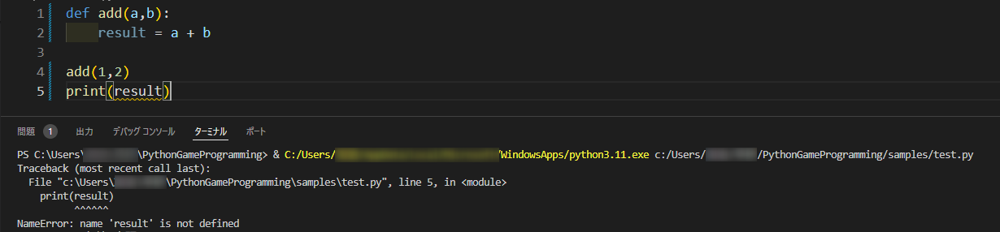

---
var:
  header-title: "Pythonで釣りゲームを作ろう 基礎編8　関数"
  header-date: "2024年04月23日（月)"
---

# 基礎編8　関数 

ある処理を「関数」としてひとつにまとめることで、同じ処理を何度も再利用することができます。関数の使い方をマスターすれば、少ない労力で分かりやすいプログラムを書く事ができます。

## もくじ

-  [関数とは](basic08.html#関数とは) 
-  [関数と引数](basic08.html#関数と引数) 
-  [関数と戻り値](basic08.html#関数と戻り値)
-  [ローカル変数とグローバル変数](basic08.html#ローカル変数とグローバル変数)


## 関数とは


`関数`の構造を見ていきましょう。

```python{.numberLines caption="関数の構造"}
def lv_up():
  lv += 1
  print("レベルが上がった！！")
```

`1行目`の`lv_up`の部分を**関数名**といい、好きに名前をつけることができます。
`2～3行目`のように、複数の処理を実行するにはそれらの行を**インデント**([参照](basic04.html#インデント))する必要があります。

ここで注意する必要があるのは、上のコードは**あくまで関数を定義しただけ**ということです。先ほどのコードを実行してみてください。**レベルが上がった！！」とは出力されません。**

定義した関数を実行するには、関数を呼び出す必要があります。次のプログラムをコピー＆ペーストして実行してみてください。

```python{.numberLines caption="関数の実行"}
def lv_up():
  lv += 1
  print("レベルが上がった！！")
lv_up()
```

**<i class="fa-solid fa-terminal"></i> 実行結果**

```
レベルが上がった！！
```


## 関数と引数

関数には**引数（ひきすう）**という値を与えることができます。次のプログラムを実行してみてください。

```python{.numberLines caption="関数と引数"}
def lv_up(name):
  print(name+"のレベルが上がった！！")

lv_up("勇者")
lv_up("賢者")
```

**<i class="fa-solid fa-terminal"></i> 実行結果**

```
勇者のレベルが上がった！！
賢者のレベルが上がった！！
```

引数を複数指定することもできます。`,(カンマ)`を用いて記述します。

```python{.numberLines caption="複数の引数はカンマで区切る"}
def division(a,b):
  print(str(a)+"÷"+str(b)+"="+str(a//b)+"あまり"+str(a%b))

division(13,3)
```

**<i class="fa-solid fa-terminal"></i> 実行結果**

```
13÷3=4あまり1
```

このように、引数を用いることで同じような処理をひとまとめにできます。


## 関数と戻り値

引数は関数に値を与えることができますが、逆に関数から値を受け取ることもできます。それが**戻り値**です。

```python{.numberLines caption="関数と引数"}
def add(a,b):
  return a+b

print(add(5,6))
```

**<i class="fa-solid fa-terminal"></i> 実行結果**

```
11
```


少し難しいですが、プログラムを見ながら動作を確認しましょう。

- 実行すると、1～2行目は関数の**定義なので**何も処理が行われません。
- 3行目のprint文の中身にある**add(5,6)**によって、関数が呼び出されます。
- a=5,b=6として関数の中で処理が行われ、戻り値として`11`が出力されます。
- print文の中身が`11`になるので、`11`が表示されます。


## ローカル変数とグローバル変数

### ローカル変数

ブロック(インデントされているまとまり)の中で宣言した変数は、他のブロックでは使えません。以下のコードを実行すると**エラー**になります。

```python{.numberLines caption="ローカル変数"}
def add(a,b):
    result = a + b

add(1,2)
print(result)
```




関数の中で変数`result`を定義しているので、関数の外で変数を参照しようとするとエラーになります。このように、関数の中定義され、関数の中でしか使えない変数のことを**ローカル変数**といいます。


### グローバル変数

この問題を解決するには`result`をグローバル変数にする必要があります。つまり、`result`を関数の外で定義すればよいわけです。しかし、ただ関数の外で宣言すればうまくいくかというと、そうではありません。

```python{.numberLines caption="グローバル変数（失敗例）"}
result = 0
def add(a,b):
    result = a + b

add(1,2)
print(result)
```

**<i class="fa-solid fa-terminal"></i> 実行結果**

```
0
```

この場合でも、関数の中の`result`と、関数の外の`result`は違うものだとみなされてしまいます。関数の中の`result`がグローバル変数であることを明記しなけれまなりません。n個のグローバル変数を利用したいとき、関数の初めに以下の形式で記述します。

```python{}
global 変数名1,変数名2,...,変数名n
```

これを用れば、うまく変数の中身を受け渡せるようになります。

```python{.numberLines caption="グローバル変数（失敗例）"}
result = 0
def add(a,b):
  global result
    result = a + b

add(1,2)
print(result)
```

**<i class="fa-solid fa-terminal"></i> 実行結果**

```
3
```