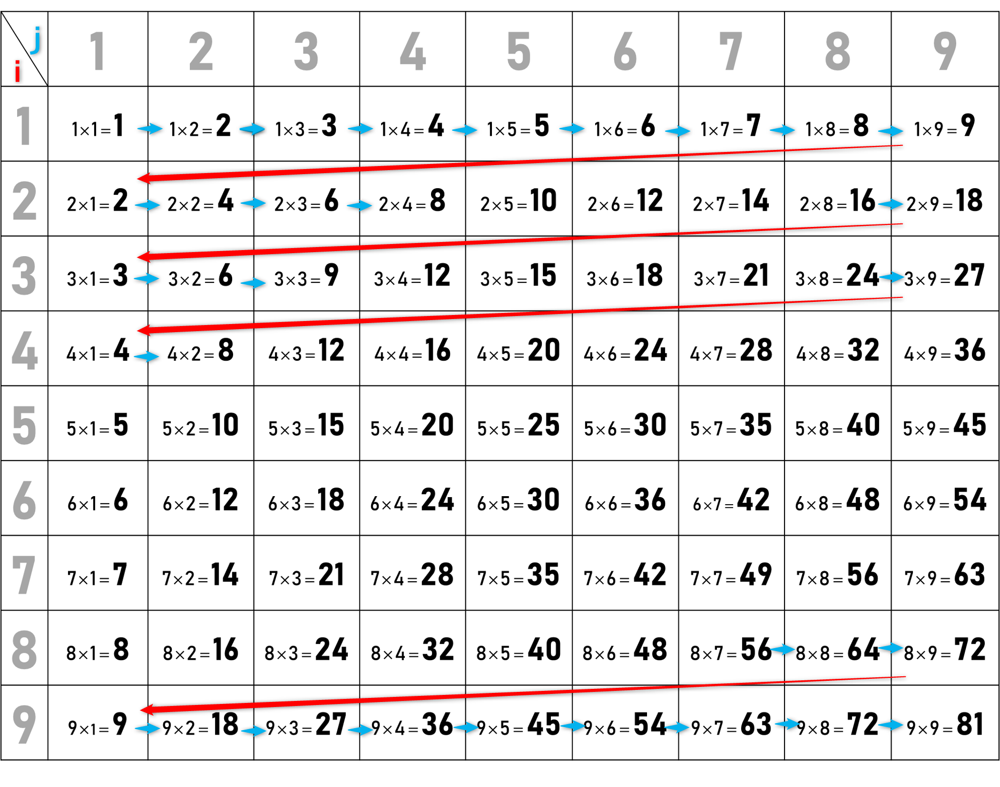

---
var:
  header-title: "Pythonで釣りゲームを作ろう 基礎編9　for文"
  header-date: "最終更新日：2024年11月02日（土）"
---

# 基礎編9 for文 


## もくじ

-  [for文とは](basic09.html#for文とは) 
-  [forの構造](basic09.html#for文の構造) 
-  [二重ループ](basic09.html#二重ループ) 


## for文とは

今まで学んだプログラムでは、前から順番にコードが実行され、最後まで処理が終わると終了していました。
しかし、実際のゲームではどうでしょうか？多くの場合、**プレイヤーが「終了」を選択するまでゲームは動き続けます**。
for文を用いることで、同じ処理を繰り返し行うことができます。


## for文の構造

```python{.numberLines caption="for文の構造"}
for i in range(1,5):
    print(i)
```

**<i class="fa-solid fa-terminal"></i> 実行結果**
```
1
2
3
4
```


繰り返し複数の処理を行う場合は、それらすべてをインデントする必要があります。

'i'は繰り返しに使う変数です。慣例的にi,j,kといった文字がよく用いられます。

range()の部分が変数の**範囲**です。ただし、**初めの数は含まれるが、終わりの数は含まれない**ことに注意してください。
上のコードではiが**1から4**の範囲で処理が繰り返されます。


---


変数の範囲ではなく、繰り返し回数を指定することもできます。この場合も、**5ではなく4で終わる**ことに注意してください。


```python{.numberLines caption="繰り返し回数の指定"}
for i in range(5):
    print(i)
```


**<i class="fa-solid fa-terminal"></i> 実行結果**
```
0
1
2
3
4
```


変数の増加する幅を3つめの引数で指定することもできます。


```python{.numberLines caption="増加間隔の指定"}
for i in range(1,11,2):
    print(i)
```

**<i class="fa-solid fa-terminal"></i> 実行結果**
```
2
4
6
8
10
```

#### **charenge9** 

6の段の九九を出力するプログラムを作成してください。

<br>
<br>
<br>
---

#### **解答**


```python{.numberLines caption="9-1解答"}
for i in range(1,10):
    print("6 x "+str(i)+" = "+str(6*i))
```


## 二重ループ

for文を入れ子構造にすることで、より複雑な処理を行うことができます。
以下のプログラムを実行してください。

```python{.numberLines caption="二重ループ"}
for i in range(1,10):
    for j in range(1,10):
        print(str(i)+" x "+str(j)+" = "+str(i*j))
```

どのように動作するのか、理解するのが難しいかもしれませんが、順を追って考えましょう。



1. 外側の繰り返し文に入ります。`i`は**1**です。
2. 内側の繰り返し文に入ります。`j`も**1**です。
3. 内側が繰り返されて`j`が1,2,3,...と増えていきます。つまり、1x1,1x2,1x3と出力されていきます。
4. `j`が9までいくと内側の繰り返しから抜けます。
5. 外側が繰り返され、`i`が1つ増えて**2**になります。
6. 再び内側の繰り返し文に入ります。`j`は**1**から繰り返されて1,2,3,...と増えていきます。つまり、2x1,2x2,2x3と出力されていきます。
7. 以上が繰り返され、9の段までいくと終わります。


## マップを表示してみよう

今までに学んだことを組み合わせると、簡単なマップ表示ができます。

```python{.numberLines caption="マップ表示"}
map_data = [
    [1, 1, 1, 1, 1],
    [1, 0, 0, 0, 1],
    [1, 0, 1, 0, 1],
    [1, 0, 1, 0, 0],
    [1, 0, 1, 1, 1],
]

# 配列の数字を記号に変換する関数
def drawmap(n):
    if n == 0:
        return "□"
    elif n == 1:
        return "■"
    else:
        return " "

# 地図を表示する
for i in range(5):
    line = ""  # 各行の文字列を作成
    for j in range(5):
        line += drawmap(map_data[i][j]) # 配列の上からi番目、左からj番目を文字列に加える
    print(line)  # 行ごとに出力
```