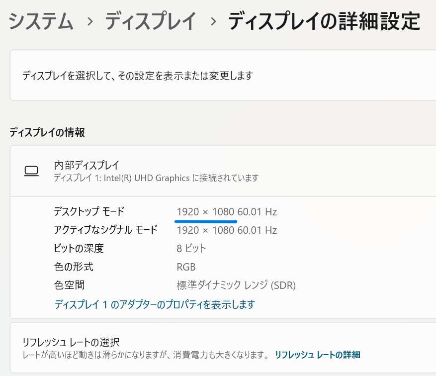
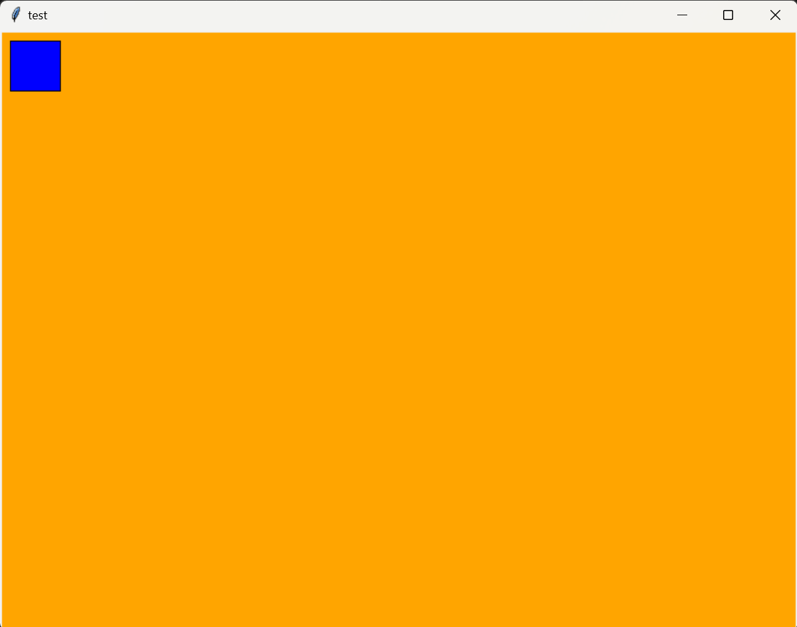
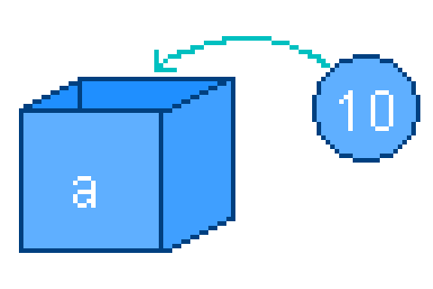
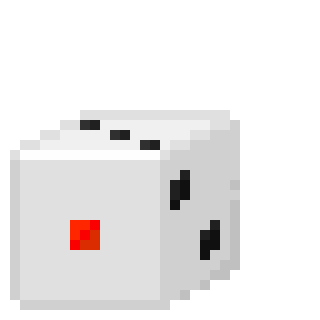

---
var:
  header-title: "Pythonで釣りゲームを作ろう プロトタイプ版"
  header-date: "2024年08月29日"
---

# Pythonで釣りゲームを作ろう プロトタイプ版

## 今回の趣旨について

私は卒業研究として、「高専1年生を対象としたゲーム作りを通じてPythonプログラミングを学べる教材づくり」を行っております。今回のデモ講座では、教材の方向性の確認や、教材の有効性の検証を目的としております。今日の最後には、アンケートを実施します。ご協力いただきますよう、よろしくお願いします。

## はじめに

このオンラインテキストでは、**ゲームづくりを通じて、Pythonプログラミングを学ぶことができます**。
本来は**90分x8回**の講義で、テキストを進めると**最終的にゲームが完成する**形式ですが、今回は短い時間のため、**サンプルを改造しながら、Pythonについて学ぶ**形式になっています。

## もくじ

-  [環境構築](digest.html#環境構築) 
-  [キーボードでキャラクターを操作](digest.html#キーボードでキャラクターを操作) 
-  [変数とは](digest.html#変数とは)
-  [ガチャを作ろう！](digest.html#ガチャを作ろう！) 


## 環境構築

Pythonでプログラミングをするためには、環境の構築が必要です。レポートを書くためにWordやGoogleDocumentといったテキストエディタが必要であるのと同じように、**プログラミングにはソースコードエディタが必要**です。今回は、**Visual Studio Code**(VSCode)とよばれるソースコードエディタを用います。

[このページ](https://gammasoft.jp/blog/how-to-start-visual-studio-code-for-python/)に従って、環境構築を行ってください。


<br>

## キーボードでキャラクターを操作

### まずはサンプルを触ってみる

`move-rect.py`を新規作成し、以下のプログラムをコピー＆ペーストして実行してみてください。すると、画像のような画面が表示されると思います。


**矢印キーもしくはWASDで操作**できます。押してみて、四角形が移動することを確認してください。

```python{.numberLines caption="move-rect.py"}
import tkinter as tk

# ウィンドウ設置
root = tk.Tk()
root.title("move-rect")
root.geometry("600x300")

# キャンバス設置
canvas = tk.Canvas(root,width = 600,height = 300,bg = "skyblue")
canvas.pack()

# 四角形を配置
rect_size = 50
x = 10
y = 10
canvas.create_rectangle(x,y,x+rect_size,y+rect_size,fill="blue",tag="rect")

# 何かのキーが押されたときに実行される関数
def on_key_press(event):
    global x,y
    speed = 5
    key = event.keysym # 変数keyに「w」や「a」など、押したキーの名前が格納される
    if(key == "w" or key == "Up"):
        print("↑")
        y = y - speed
    elif(key == "a" or key == "Left"):
        print("←")
        x = x - speed
    elif(key == "s" or key == "Down"):
        print("↓")
        y = y + speed
    elif(key == "d" or key == "Right"):
        print("→")
        x = x + speed
    
    canvas.delete("rect")
    canvas.create_rectangle(x,y,x+rect_size,y+rect_size,fill="blue",tag="rect")

# メインループ
root.bind("<KeyPress>", on_key_press)
root.mainloop()
```

**ウィンドウの×ボタンを押すとプログラムが終了します。**
<br>

### ウィンドウのタイトルを変更する

`3行目`の`root.title("move-rect")`でウィンドウのタイトルを**move-rect**に設定しています。試しに、`"test"`に変更してみてください。

```python{.numberLines startFrom="3" caption="move-rect.py(抜粋)"}
# ウィンドウ設置
root = tk.Tk()
root.title("test")　<-ここを変更
root.geometry("400x600") 
```

プログラムを実行して、タイトルが変わっていることを確認してください。

<br>

### ウィンドウの大きさを変更する

`6行目`の`"600x300"`の部分で、**表示するウィンドウのサイズを指定**しています。試しに、`"600x300"`を`"400x600"`に変更してみてください。

```python{.numberLines startFrom="3" caption="move-rect.py(抜粋)"}
# ウィンドウ設置
root = tk.Tk()
root.title("move-rect")
root.geometry("400x600") <-ここを変更
```

実行すると、ウィンドウが縦長に変わります。このように、ウィンドウのサイズを`"幅x高さ"`で指定できます。`600`や`400`といった数字は**ピクセル数**を表しています。


<br>

<div class="note type-tips">

**ディスプレイの解像度を調べる**

モニターのピクセル数は設定から調べることができます。

**設定　＞　システム　＞　ディスプレイ　＞　ディスプレイの詳細設定**



この場合、`1920x1080`がディスプレイ全体のサイズになります。
</div>
<br>

- **Challenge**　ディスプレイの解像度を参考にして、ウィンドウが**画面に大きく表示されるように**、適当なサイズに変更してください。

<br>

### キャンバスを変更する

キャンバスは、**図形や画像を設置するために必要な下地**です。

`10行目`ではキャンバスの大きさや色を指定しています。
`width`が**幅**、`height`が**高さ**、`bg`が**背景色**に対応しています。
幅と高さを**上で設定したウィンドウと同じ数値に変更**してみてください。

```python{.numberLines startFrom="9" caption="move-rect.py(抜粋)"}
# キャンバス設置
canvas = tk.Canvas(root,width = xxx,height = yyy,bg = "skyblue") <-ここを変更
canvas.pack()
```

以下の画像を参考に、色も変更してみましょう。`skyblue`を好きな色の名前に書き換えることで変更できます。


> 出典: https://stackoverflow.com/questions/4969543/colour-chart-for-tkinter-and-tix-using-python

例えば`orange`に変更することで、**背景色がオレンジ**になります。

```python{.numberLines startFrom="9" caption="move-rect.py(抜粋)"}
# キャンバス設置
canvas = tk.Canvas(root,width = 800,height = 600,bg = "orange") <-ここを変更
canvas.pack()
```



<br>

### 四角形を配置する

以下の部分で、用意したキャンバスに四角形を配置しています。

`14行目`の`rect_size = 50`で四角形の大きさを設定しています。試しに`100`に変更して、四角形が大きくなることを確認してください。

```python{.numberLines startFrom="13" caption="move-rect.py(抜粋)"}
# 四角形を配置
rect_size = 100 <-ここを変更
x = 10
y = 10
canvas.create_rectangle(x,y,x+rect_size,y+rect_size,fill="blue",tag="rect")
```

`15～16行目`の`x = 10`、`y = 10`の部分で、四角形の左上の角の座標を指定しています。数字を変更することで、四角形の初期位置を変更できます。

ただし、プログラミングで用いられる座標軸は、**数学で用いられるものと向きが違う**ので**注意が必要です**。


モニターの**左上が原点**で、**Y軸が反転**しています。

**xやyの値を変えて、それぞれが四角形の位置にどのように対応しているか確認してください**。

```python{.numberLines startFrom="13" caption="move-rect.py(抜粋)"}
# 四角形を配置
rect_size = 100 
x = 10　<-ここを変更
y = 10 <-ここを変更
canvas.create_rectangle(x,y,x+rect_size,y+rect_size,fill="blue",tag="rect")
```

<div class="note type-tips">

**このプログラムのしくみ**

`14行目`から`16行目` では**変数**というものを使用しています。

```python{.numberLines startFrom="13" caption="move-rect.py(抜粋)"}
# 四角形を配置
rect_size = 50
x = 10
y = 10
canvas.create_rectangle(x,y,x+rect_size,y+rect_size,fill="blue",tag="rect")
```

`14行目`の`rect_size = 50`は、**「今後`rect_size`という名前が出てきたらそれを50と読み替えてください」**という意味です。

[変数](digest.html#変数とは) については後ほど**詳しく解説します**。


そして、`canvas.create_rectangle`という命令で四角形を配置しています。
以下のように四角形の**左上と右下の座標**、**色**、**名前**を指定しています。


</div>
<br>

### キーボードが押されたときの処理を設定する

`19行目`からはキーボードが押されたときの処理が記述されています。

`22行目`の`speed = 10`で四角形が移動する速度を設定しています。
数値を変更して、**移動速度が変わることを確認**してください。

```python{.numberLines startFrom="19" caption="move-rect.py(抜粋)"}
# 何かのキーが押されたときに実行される関数
def on_key_press(event):
    global x,y
    speed = 10 <-ここを変更
    key = event.keysym # 変数keyに「w」や「a」など、押したキーの名前が格納される
```

<br>

### キーボードが押されたか判定する

`23行目`の`key = event.keysym`では、変数keyに「w」や「a」など、押したキーの名前を代入しています。

`24行目`からは`if文`と呼ばれる、**条件分岐**をおこなう部分です。後に詳しく解説するので、今は飛ばしてOKです。

```python{.numberLines startFrom="23" caption="move-rect.py(抜粋)"}
    key = event.keysym # 変数keyに「w」や「a」など、押したキーの名前が格納される
    if(key == "w" or key == "Up"):
        print("↑")
        y = y - speed
    elif(key == "a" or key == "Left"):
        print("←")
        x = x - speed
    elif(key == "s" or key == "Down"):
        print("↓")
        y = y + speed
    elif(key == "d" or key == "Right"):
        print("→")
        x = x + speed
```

<br>

### まとめ

ここまでキーボードで四角形を操作するプログラムの簡単な説明を行いました。
このようにプログラムでは、**1つ1つの命令を組み合わせて**複雑な動作を実現しています。
自分でプログラムを書くためには、この**1つ1つの命令文を知る**ことが大事になります。今回は、特に基本となる命令について学びましょう。

---

<br>

## 変数とは



変数とは、**データを入れておく箱**のようなもので、箱の中身は**いつでも確認したり変更することができます**。
変数`a`に値`10`を入れるときは、以下のように書きます。


```python
a = 10
```
この変数に値を入れる`=`は、**代入演算子**と呼ばれます。

</br>

---

変数に入れた値は、**簡単に**取り出すことができます。print文の`()`の中に変数名を記述するだけです。新しいファイル`test3-1.py`を作成してください。（方法は[環境構築で参考にしたページ](https://gammasoft.jp/blog/how-to-start-visual-studio-code-for-python/)の最後の方を確認してください。）

```python{.numberLines caption="test3-1.py"}
a = 10
print(a)
```
**<i class="fa-solid fa-terminal"></i> 実行結果**

```
10
```

1行目で変数`a`に10を代入しています。そのため、2行目のprint文の`()`の中の`a`は10と読み替えられました。

<br>
<div class="note type-tips">

**「=」の使い方に注意!!**

代入演算子`=`は、**数学で使うものとは意味が異なり、左の変数に右の値を代入するはたらき**を持ちます。
そのため、以下のプログラムを実行するとエラーが起きます。

```python{.numberLines caption="test.py"}
10 = a
print(a)
```
**<i class="fa-solid fa-terminal"></i> 実行結果**

```
PS C:\******> & C:/******/python.exe c:/******/test.py
  File "c:\******\test.py", line 1
    10 = a
    ^^
SyntaxError: cannot assign to literal here. Maybe you meant '==' instead of '='?
```

「`10`は**変数ではないので代入できません**」と言われてしまいます。


</div>

---

## 変数の値を変更する

変数に代入し直せば、変数の値を変更することができます。

```python{.numberLines caption="test3-3.py"}
a = 10
print(a)
a = 20
print(a)
```
**<i class="fa-solid fa-terminal"></i> 実行結果**

```
10
20
```

<br>

---

**四則演算は以下のようにして表記します**

```python{.numberLines caption="四則演算"}
a = 1 + 2 #足し算
b = 2 - 1 #引き算
c = 2 * 2 #掛け算
d = 4 / 2 #割り算
```

掛け算には`*`(アスタリスク)を、割り算には`/`(スラッシュ)を用いるのが数学とは異なる点です。

---

**`a = a + 2`と書けば、`a`の値を2だけ増やすことができます**。


```python{.numberLines caption="test3-4.py"}
a = 10
print(a)
a = a + 2
print(a)
```
**<i class="fa-solid fa-terminal"></i> 実行結果**

```
10
12
```

---

- **Challenge1**　上のプログラムの1行目を書き換えて、`a`の値を`123`に変更しましょう。
- **Challenge2**　3行目を書き換えて、`a`の値を**2倍**にするよう変更しましょう。

**<i class="fa-solid fa-check"></i>解答**

Challenge1: <span class="masked">`a = 123`</span>

Challenge2: <span class="masked">`a = a * 2`</span>

</br>

---


## 変数の命名規則

変数名のつけ方には以下の決まりがあります。

### 半角のアルファベット、数字、`_`(アンダースコア)を組み合わせる

日本語やその他の記号は使わないようにしましょう。

```python{.numberLines caption="⭕良い例"}
a = 10
```
```python{.numberLines caption="❌悪い例"}
ｓｃｏｒｅ = 99    <-全角
スコア = 99    <-変数名が日本語
stage2-1 = 99 <-「-」は引き算の記号として認識される
```

### 最初の文字には数字を使わない

2文字目以降は自由に使えます。

```python{.numberLines caption="⭕良い例"}
sum = 7
```
```python{.numberLines caption="❌悪い例"}
1st_sum = 7
```

### 予約語を使わない

たとえば`print`のような、Pythonへの命令として決まっている単語をそのまま使うことはできません。

```python{.numberLines caption="❌悪い例"}
print = 5
print(print)
```

**<i class="fa-solid fa-terminal"></i> 実行結果**

```
PS C:\******> & C:/******/python.exe c:/******/test.py
  File "c:\******\test.py", line 2, in <module>
    print(print)
TypeError: 'int' object is not callable
```

1行目でprintに値が上書きされてしまったので、その後ろではprint文が使えなくなってしまいます。

---

#### **charenge2-3** 次の変数名は適切か判断しましょう。

- `tmp` ・・・ <span class="masked">⭕　　　　　　　　　　　　　　</span>
- `Name` ・・・ <span class="masked">❌全て小文字にするべきです</span>
- `24th_anniversary` ・・・ <span class="masked">❌最初の文字は数字ではいけません</span>
- `g20` ・・・ <span class="masked">⭕　　　　　　　　　　　　　　</span>
- `high-school` ・・・ <span class="masked">❌`-`(ハイフン)は引き算として認識されてしまいます</span>


<br>

## 乱数
`random`モジュールを用いると、ランダムな数を生成したり、リストからランダムに抽出することができます。

### random.randint()



`random.randint(a,b)`を使って**a~b**までの整数を生成します。

以下のコードを実行してみてください。さいころと同じふるまいをします。
1行目の`import random`で、`random`モジュールを読み込み、使用できるようにしています。

```python{.numberLines}
import random

print(random.randint(1,6))
```


**<i class="fa-solid fa-terminal"></i> 実行結果**

```
3
```

</br>

---

- **Challenge1-1**　上のプログラムを改造して、1~50までの乱数を表示するプログラムを作成しましょう。
- **Challenge1-2**　さらに改造して、2~100までのランダムな**偶数**を表示するプログラムを作成しましょう。

ヒント: <span class="masked">`2から100までの偶数を数学的に書くと`2n (1 <= n <= 50)`となります。`</span>


**<i class="fa-solid fa-check"></i>解答**

Challenge1-1: <span class="masked">`print(random.randint(1,50))`</span>

Challenge1-2: <span class="masked">`print(random.randint(1,50) * 2)`</span>

</br>

### random.choice()
`random.choice(list)`を使って`list`からランダムに要素を選択します。

以下のコードを実行してみてください。魚の名前が入ったリストからランダムに選択して表示します。

```python{.numberLines}
import random

fishes = ["アジ","サバ","イワシ","タイ","サメ"]
print(random.choice(fishes))
```

**<i class="fa-solid fa-terminal"></i> 実行結果**

```
アジ
```
</br>

### random.choices()
`random.choices(list,k,weights)`を使って`list`からランダムに複数の要素を選択します。

`random.choices()`で選択された要素は**重複することがあります。**重複させたくない場合は`random.sample()`が用意されています。

以下のコードを実行してみてください。魚の名前が入ったリストからランダムに3つ選択して表示します。

```python{.numberLines}
import random

fishes = ["アジ","サバ","イワシ","タイ","サメ"]
print(random.choices(fishes,k=3))
```

**<i class="fa-solid fa-terminal"></i> 実行結果**

```
['タイ', 'イワシ', 'イワシ']
```
</br>

さらには重みをつけることもできます。引数`weights`で確率を指定します。

```python{.numberLines}
import random

fishes = ["アジ","サバ","イワシ","タイ","サメ"]
fish_weights =[30,30,30,8,2] #アジ,サバ,イワシ30%、タイ8%、サメ2%
print(random.choices(fishes,k=10,weights = fish_weights))
```

**<i class="fa-solid fa-terminal"></i> 実行結果**

```
['サバ', 'イワシ', 'アジ', 'サメ', 'アジ', 'サバ', 'イワシ', 'アジ', 'イワシ', 'イワシ']
```
</br>

<div class="note type-tips">

**配列からランダムな要素を重み付きで取り出す**

`random.choices()`を使えば、`random.choice()`ではできなかった、重みをつけて要素を取り出す操作ができました。
では、**魚の名前のリストではなく魚の名前そのものが欲しいとき、どうすれば良い**でしょうか。

まずは、先ほどのコードを`k=1`と書き換えて実行してみましょう。

```python{.numberLines}
import random

fishes = ["アジ","サバ","イワシ","タイ","サメ"]
fish_weights =[30,30,30,8,2] #アジ,サバ,イワシ30%、タイ8%、サメ2%
print(random.choices(fishes,k=1,weights = fish_weights))
```

**<i class="fa-solid fa-terminal"></i> 実行結果**

```
['イワシ']
```

</br>

ここで注意したいのは、**`k=1`と指定しても、要素数1の配列が返ってくる**ことです。配列の要素を取り出すには、`list[0]`のように**インデックスで指定**します。

`random.choices(・・・)[0]`と指定することで、配列からランダムな要素を重み付きで取り出せます。
```python{.numberLines}
import random

fishes = ["アジ","サバ","イワシ","タイ","サメ"]
fish_weights =[30,30,30,8,2] #アジ,サバ,イワシ30%、タイ8%、サメ2%
print(random.choices(fishes,k=1,weights = fish_weights)[0])
```

**<i class="fa-solid fa-terminal"></i> 実行結果**

```
イワシ
```
</br>

</div>


### 応用


以下の要件を満たすプログラムを作成していきましょう。

- レア度は★1~★3まであり、排出率は以下の通りです。

    **★1**: 75%
    **★2**: 20%
    **★3**: 5%

- それぞれのレア度には3種類の魚があり、以下のリストの通りです。同じレア度の中で何が選ばれるかはランダムです。

```python{.numberLines caption="魚のランク"}
STAR_1 = ["アジ","サバ","イワシ"]
STAR_2 = ["カワハギ","タチウオ","メバル"]
STAR_3 = ["タイ","スズキ","カサゴ"]
```

</br>

先ほどの例をそのまま使えば以下のようになりますが、これではあまりよくありません。

```python{.numberLines caption="良くない例"}
import random

FISH_LIST = ["アジ","サバ","イワシ","カワハギ","タチウオ","メバル","タイ","スズキ","カサゴ"]
FISH_WEIGHT = [25,25,25,20/3,20/3,20/3,5/3,5/3,5/3] #それぞれの排出率
print(random.choices(FISH_LIST,k=1,weights=FISH_WEIGHT)[0])
```

要件通りには動くのですが、他人や未来の自分にとって読みにくく、何か改良しようとすると大変なコードです。具体的には以下の欠点が挙げられます。

- どの魚がどのランクなのかわかりにくい
- それぞれのランクの排出率がわかりにくい
- 魚の種類を追加したとき、`FISH_WEIGHT`を何か所も変更する必要がある。

</br>

これらを解決するためにはどうすれば良いでしょうか。

今回は**初めにレア度を排出率に従って決定し、次にその中からランダムに魚を選ぶ方法**を取りましょう。まずは排出率に従って「★n」と表示するプログラムを作成します。

```python{.numberLines caption="レア度を排出率に従って決定する"}
import random

FISH_LIST = ["★1","★2","★3"] 
FISH_WEIGHT = [75,20,5] #★1～3の排出率
print(random.choices(FISH_LIST,k=1,weights=FISH_WEIGHT)[0])
```

**<i class="fa-solid fa-terminal"></i> 実行結果**

```
★1
```
</br>

次に、「★n」の部分をそれぞれの魚のリストに置き換えます。

```python{.numberLines caption="レア度を排出率に従って決定する"}
import random

STAR_1 = ["アジ","サバ","イワシ"]
STAR_2 = ["カワハギ","タチウオ","メバル"]
STAR_3 = ["タイ","スズキ","カサゴ"]

FISH_LIST = [STAR_1,STAR_2,STAR_3] #2次元配列であることに注意！
FISH_WEIGHT = [75,20,5] #★1～3の排出率
print(random.choices(FISH_LIST,k=1,weights=FISH_WEIGHT)[0])
```

**<i class="fa-solid fa-terminal"></i> 実行結果**

```
['アジ', 'サバ', 'イワシ']
```

</br>

リストが出力されているので、さらにこれを`random.choice()`で選択すれば良いですね。

```python{.numberLines caption="randomfish.py"}
import random

STAR_1 = ["アジ","サバ","イワシ"]
STAR_2 = ["カワハギ","タチウオ","メバル"]
STAR_3 = ["タイ","スズキ","カサゴ"]

FISH_LIST = [STAR_1,STAR_2,STAR_3] #2次元配列であることに注意！
FISH_WEIGHT = [75,20,5] #★1～3の排出率

print(random.choice(random.choices(FISH_LIST,k=1,weights=FISH_WEIGHT)[0]))
```

**<i class="fa-solid fa-terminal"></i> 実行結果**

```
サバ
```

</br>


**うまくいきました！これは釣りゲームの部品になるので、後で再利用できるように適当な名前を付けて保存しておきましょう。**
これはよくない例と比較して格段に修正、改造しやすくなっています。次のChallengeで確認してください。

---
- **Challenge2-1**　上のプログラムを改造して、★2に「コイ」を追加しましょう。
- **Challenge2-2**　**★4**の魚を追加してみましょう。排出率も適当に調節してください。
