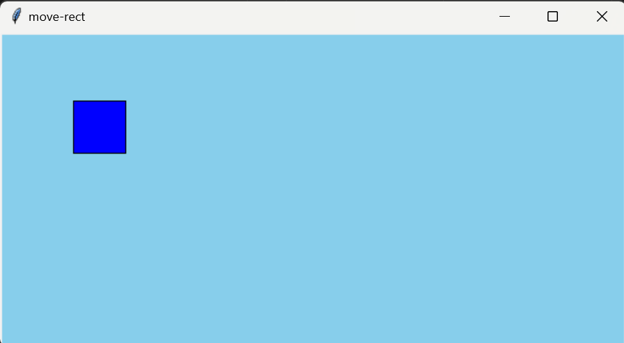

---
var:
  header-title: "Pythonで釣りゲームを作ろう プロトタイプ版"
  header-date: "2024年08月28日"
---

# Pythonで釣りゲームを作ろう プロトタイプ版

## 今回の趣旨について

私は卒業研究として、「高専1年生を対象としたゲーム作りを通じてPythonプログラミングを学べる教材づくり」を行っております。今回のデモ講座では、教材の方向性の確認や、教材の有効性の検証を目的としております。今日の最後には、アンケートを実施します。ご協力いただきますよう、よろしくお願いします。

## はじめに

このオンラインテキストでは、**ゲームづくりを通じて、Pythonプログラミングを学ぶことができます**。
本来は**90分x8回**の講義で、テキストを進めると**最終的にゲームが完成する**形式ですが、今回は短い時間のため、**サンプルを改造しながら、Pythonについて学ぶ**形式になっています。

## もくじ　※要編集

-  [環境構築](basic05.html#条件分岐とは) 
-  [キーボードでキャラクターを操作](basic05.html#if文) 
-  [関係演算子](basic05.html#関係演算子)
-  [if-else文](basic05.html#if-else文) 
-  [if-elif文](basic05.html#if-elif文) 

## 環境構築

Pythonでプログラミングをするためには、環境の構築が必要です。レポートを書くためにWordやGoogleDocumentといったテキストエディタが必要であるのと同じように、**プログラミングにはソースコードエディタが必要**です。今回は、**Visual Studio Code**(VSCode)とよばれるソースコードエディタを用います。


### VSCodeのインストール

以下のページから、VSCodeをインストールしてください。

[https://code.visualstudio.com/download](https://code.visualstudio.com/download)

... (インストーラの起動とインスト)
[参考資料](https://note.com/yuuuu_tech/n/nf7d25a6a74d9)

### Pythonのインストール

### VSCodeでPythonを使う設定

### 初めてのプログラミング

（ファイルの作り方、プログラムの記述、実行）

<br>

## キーボードでキャラクターを操作

### まずはサンプルを触ってみる

以下のプログラムをコピー＆ペーストして実行してみてください。すると、画像のような画面が表示されると思います。



**矢印キーもしくはWASDで操作**できます。押してみて、四角形が移動することを確認してください。

```python{.numberLines caption="move-rect.py"}
import tkinter as tk

# ウィンドウ設置
root = tk.Tk()
root.title("move-rect")
root.geometry("600x300")

# キャンバス設置
canvas = tk.Canvas(root,width = 600,height = 300,bg = "skyblue")
canvas.pack()

# 四角形を配置
rect_size = 50
x = 10
y = 10
canvas.create_rectangle(x,y,x+rect_size,y+rect_size,fill="blue",tag="rect")

# 何かのキーが押されたときに実行される関数
def on_key_press(event):
    global x,y
    speed = 5
    key = event.keysym # 変数keyに「w」や「a」など、押したキーの名前が格納される
    if(key == "w" or key == "Up"):
        print("↑")
        y = y - speed
    elif(key == "a" or key == "Left"):
        print("←")
        x = x - speed
    elif(key == "s" or key == "Down"):
        print("↓")
        y = y + speed
    elif(key == "d" or key == "Right"):
        print("→")
        x = x + speed
    
    canvas.delete("rect")
    canvas.create_rectangle(x,y,x+rect_size,y+rect_size,fill="blue",tag="rect")

# メインループ
root.bind("<KeyPress>", on_key_press)
root.mainloop()
```

**ウィンドウの×ボタンを押すとプログラムが終了します。**
<br>

### ウィンドウの大きさを変更する

`6行目`の`"600x300"`の部分で、**表示するウィンドウのサイズを指定**しています。試しに、`"600x300"`を`"400x600"`に変更してみてください。

```python{.numberLines startFrom="3" caption="move-rect.py(抜粋)"}
# ウィンドウ設置
root = tk.Tk()
root.title("move-rect")
root.geometry("400x600") <-ここを変更
```

実行すると、ウィンドウが縦長に変わります。このように、ウィンドウのサイズを`"幅x高さ"`で指定できます。`600`や`400`といった数字は**ピクセル数**を表しています。


<br>

<div class="note type-tips">

**ディスプレイの解像度を調べる**

モニターのピクセル数は設定から調べることができます。

**設定　＞　システム　＞　ディスプレイ　＞　ディスプレイの詳細設定**


この場合、`1920x1080`がディスプレイ全体のサイズになります。
</div>
<br>